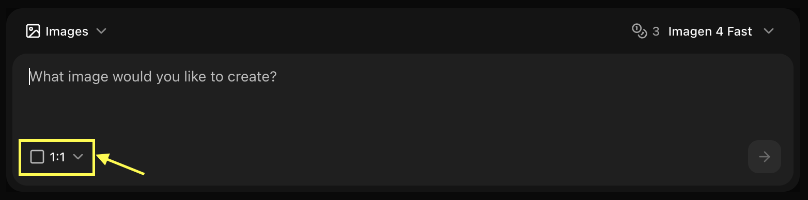
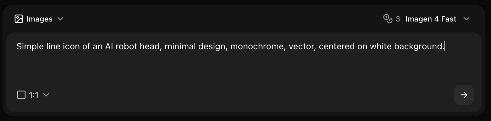
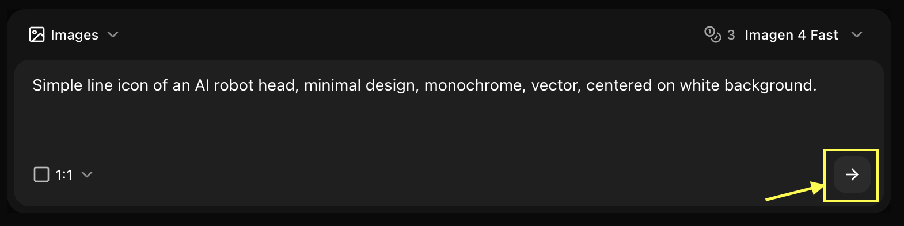

## Overview

Imagen 4 Fast provides professional-quality images with faster generation times, ideal for projects requiring quick turnaround without sacrificing quality.

## Quick Start

<Steps>
  <Step title="Navigate to Image Generator by Clicking on New Image">
    Go to the Image Generator tool in your Zoice dashboard by clicking on New Image.
    <Frame>
      
    </Frame>
  </Step>
  <Step title="Select Imagen 4 Fast Model">
    Choose "Imagen 4 Fast" from the model selector.
    <Frame>
      
    </Frame>
  </Step>
  <Step title="Configure Settings for Image">
    Set resolution for the image you want to generate.
    <Frame>
      
    </Frame>
  </Step>
  <Step title="Write Your Prompt">
    Enter a detailed description of the image you want to create in the prompt box.
    <Frame>
      
    </Frame>
  </Step>
  <Step title="Click on Generate">
    Click generate and wait few seconds for your image to be generated.
    <Frame>
      
    </Frame>
  </Step>
  <Step title="Download">
    Save your generated image
  </Step>
</Steps>

## Best Practices

- Use clear, detailed prompts
- Leverage fast generation for iterations
- Perfect for time-sensitive projects

## Next Steps

<CardGroup cols={2}>
  <Card title="Model Overview" icon="info" href="/ai-models/image/imagen-4-fast/overview">
    Learn about Imagen 4 Fast
  </Card>
  <Card title="Prompt Guide" icon="book" href="/prompt-guide/introduction">
    Improve your prompts
  </Card>
  <Card title="Image Generator Tool" icon="image" href="/features/image-generator">
    Back to the main Image Generator guide
  </Card>
</CardGroup>
