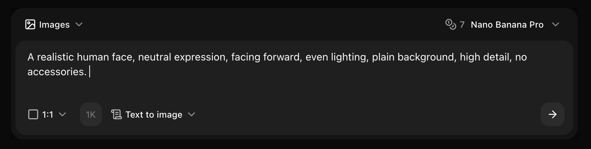
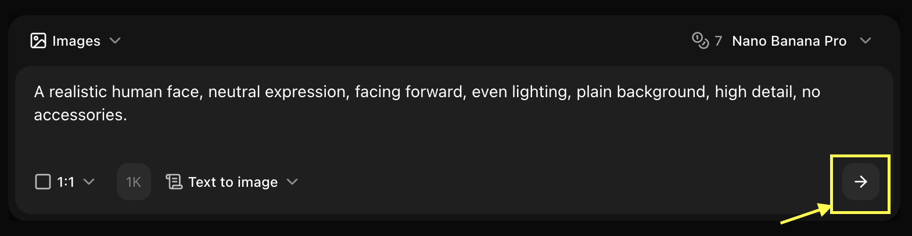

## Overview

Imagen 4 Ultra delivers maximum quality and resolution for professional projects. This guide shows you how to leverage its advanced capabilities for print-ready, ultra-detailed images.

## Quick Start

<Steps>
  <Step title="Navigate to Image Generator by Clicking on New Image">
    Go to the Image Generator tool in your Zoice dashboard by clicking on New Image.
    <Frame>
      
    </Frame>
  </Step>
  <Step title="Select Imagen 4 Ultra Model">
    Choose "Imagen 4 Ultra" from the model selector.
    <Frame>
      
    </Frame>
  </Step>
  <Step title="Configure Settings for Text to Image">
    Set resolution, quality, and select text to image to get your idea into reality.
    <Frame>
      
    </Frame>
  </Step>
  <Step title="Write Your Prompt">
    Enter a detailed description of the image you want to create in the prompt box.
    <Frame>
      
    </Frame>
  </Step>
  <Step title="Click on Generate">
    Click generate and wait few seconds for your image to be generated.
    <Frame>
      
    </Frame>
  </Step>
  <Step title="Download">
    Save your generated image
  </Step>
</Steps>

## Best Practices

- Use highly detailed prompts
- Specify "8K", "ultra detailed", "professional"
- Include lighting and composition details
- Perfect for print and professional use

## Next Steps

<CardGroup cols={2}>
  <Card title="Model Overview" icon="info" href="/ai-models/image/imagen-4-ultra/overview">
    Learn about Imagen 4 Ultra
  </Card>
  <Card title="Prompt Guide" icon="book" href="/prompt-guide/introduction">
    Master prompt engineering
  </Card>
</CardGroup>
