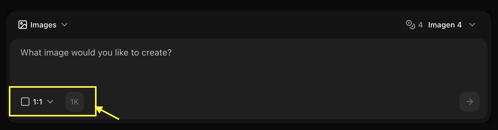
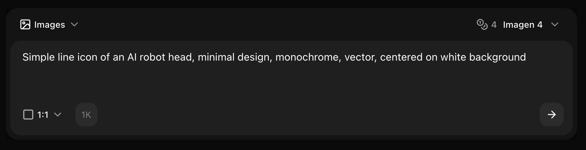
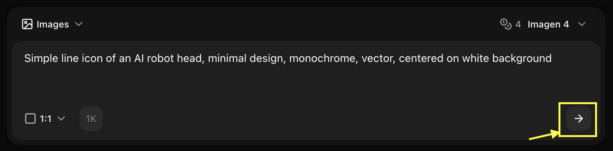

## Overview

Imagen 4 excels at creating photorealistic, detailed images from text prompts. This guide shows you how to leverage Imagen 4's advanced capabilities for professional-quality results.

## Quick Start

<Steps>
  <Step title="Navigate to Image Generator by Clicking on New Image">
    Go to the Image Generator tool in your Zoice dashboard by clicking on New Image.
    <Frame>
      
    </Frame>
  </Step>
  <Step title="Select Imagen 4 Model">
    Choose "Imagen 4" from the model selector.
    <Frame>
      
    </Frame>
  </Step>
  <Step title="Configure Settings for Image">
    Set resolution, quality, and select text to image to get your idea into reality.
    <Frame>
      
    </Frame>
  </Step>
  <Step title="Write Your Prompt">
    Enter a detailed description of the image you want to create in the prompt box.
    <Frame>
      
    </Frame>
  </Step>
  <Step title="Click on Generate">
    Click generate and wait few seconds for your image to be generated.
    <Frame>
      
    </Frame>
  </Step>
  <Step title="Download">
    Save your generated image
  </Step>
</Steps>

## Prompt Writing for Imagen 4

### Leverage Advanced Capabilities

Imagen 4 understands complex, detailed prompts:

<CodeGroup>
```text Professional Photography
Professional corporate headshot of a confident businesswoman in her 
mid-30s, shoulder-length brown hair, wearing navy blue blazer and 
white blouse, warm smile, modern office background with soft bokeh, 
natural window lighting from left creating subtle rim light, shallow 
depth of field, 85mm lens, professional photography, sharp focus on 
eyes, high quality, detailed, 4K resolution
```

```text Detailed Landscape
Majestic mountain landscape at golden hour, snow-capped peaks 
reflecting in crystal-clear alpine lake, wildflowers in foreground, 
dramatic clouds with rays of sunlight breaking through, professional 
landscape photography, wide angle composition, rich vibrant colors, 
high dynamic range, ultra detailed, sharp throughout, 8K quality, 
masterpiece
```

```text Complex Scene
Bustling modern coffee shop interior, warm ambient lighting, barista 
preparing latte with latte art, customers at wooden tables, large 
windows showing city street outside, hanging Edison bulbs, exposed 
brick wall, plants on shelves, steam rising from coffee cups, 
professional interior photography, depth of field, natural colors, 
highly detailed, photorealistic, 4K
```
</CodeGroup>

## Advanced Techniques

### Detailed Descriptions
Imagen 4 rewards comprehensive prompts:

```text
Subject: Describe in detail
Environment: Full scene description
Lighting: Specific light sources and quality
Camera: Lens, angle, composition
Style: Photography or art style
Quality: Resolution and detail keywords
```

### Photorealism Keywords
```text
- Photorealistic, hyperrealistic
- Professional photography
- Sharp focus, tack sharp
- High detail, ultra detailed
- Natural lighting, studio lighting
- Shallow/deep depth of field
- 4K, 8K resolution
```

## Best Practices

<AccordionGroup>
  <Accordion title="Be Comprehensive">
    - Include all relevant details
    - Describe lighting thoroughly
    - Specify camera settings
    - Mention composition
  </Accordion>
  
  <Accordion title="Use Professional Terms">
    - Photography terminology
    - Lighting techniques
    - Composition rules
    - Quality descriptors
  </Accordion>
  
  <Accordion title="Specify Quality">
    - Always mention resolution
    - Include "professional"
    - Add "detailed" or "sharp focus"
    - Use "high quality"
  </Accordion>
</AccordionGroup>

## Common Use Cases

### Marketing Photography
```text
Settings:
- Resolution: 4096x4096
- Guidance: 10-12
- Style: Professional commercial photography
```

### Product Photography
```text
Settings:
- Resolution: 3072x3072
- Guidance: 11-13
- Style: Studio product photography
```

### Portrait Photography
```text
Settings:
- Resolution: 2048x3072 (portrait)
- Guidance: 10-12
- Style: Professional portrait photography
```

<Tip>
Imagen 4's strength is in detailed, photorealistic images. Don't hesitate to write long, comprehensive prompts!
</Tip>

## Next Steps

<CardGroup cols={2}>
  <Card title="Model Overview" icon="info" href="/ai-models/image/imagen-4/overview">
    Learn more about Imagen 4
  </Card>
  <Card title="Imagen 4 Ultra" icon="gem" href="/ai-models/image/imagen-4-ultra/overview">
    Explore the premium version
  </Card>
  <Card title="Image Generator Tool" icon="image" href="/features/image-generator">
    Back to the main Image Generator guide
  </Card>
</CardGroup>
