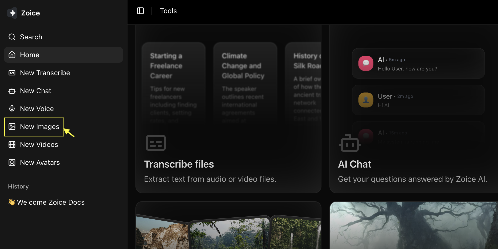
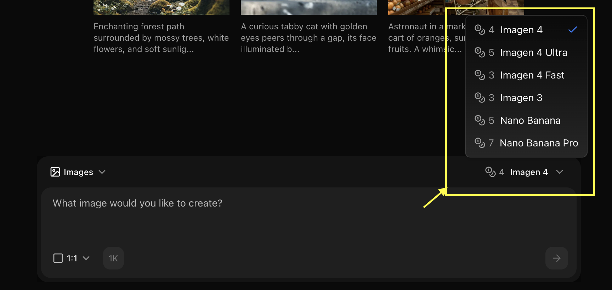
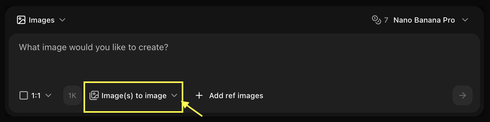
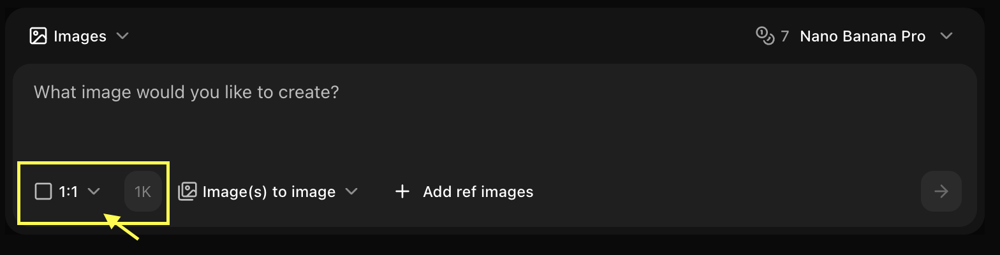
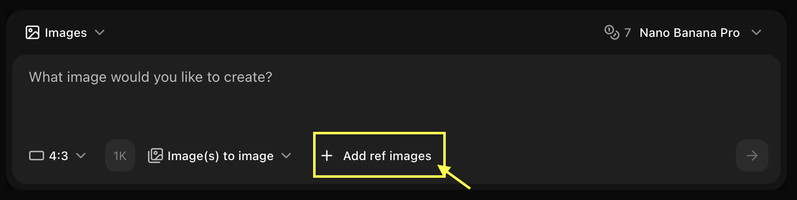
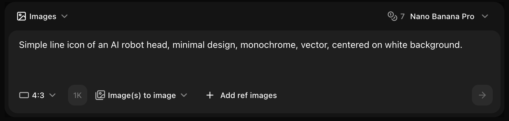
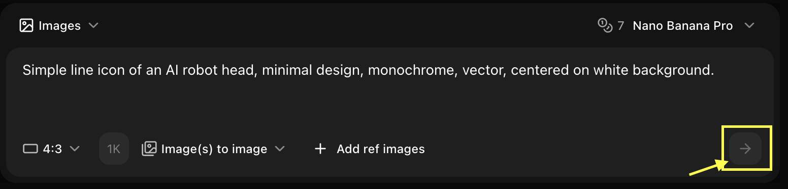

## Quick Start

The AI analyzes your input image and applies transformations based on your text prompt while maintaining the overall composition and structure of the original image.

<Steps>
  <Step title="Navigate to Image Generator by Clicking on New Image">
    Go to the Image Generator tool in your Zoice dashboard by clicking on **New Image**.
    <Frame>
      
    </Frame>
  </Step>

  <Step title="Select Nano Banana Model">
    Choose "Nano Banana" from the model selector.
    <Frame>
      
    </Frame>
  </Step>

  <Step title="Select Image to Image">
    Choose the **Image to Image** mode to begin transforming your reference visuals.
    <Frame>
      
    </Frame>
  </Step>

  <Step title="Select Size and Resolution">
    Set your preferred aspect ratio and resolution to match your output requirements.
    <Frame>
      
    </Frame>
  </Step>

  <Step title="Upload Reference Image">
    Click on **Add Ref Image** to select and upload the image you want to use as a base.
    <Frame>
      
    </Frame>
  </Step>

  <Step title="Type Detailed Prompt">
    Enter a detailed description of how you want the AI to modify or enhance your reference image.
    <Frame>
      
    </Frame>
  </Step>

  <Step title="Generate">
    Click on **Generate** and wait a few seconds for your transformed image to be created.
    <Frame>
      
    </Frame>
  </Step>
</Steps>

## Reference Image Requirements

### Technical Specs
- **Formats**: JPG, PNG, WebP
- **Max Size**: 10MB
- **Recommended Resolution**: 1024x1024 or higher
- **Aspect Ratio**: Any (will be adjusted to match output)

### Content Guidelines
- Clear, high-quality images work best
- Good lighting and focus
- Relevant to desired output
- Simple compositions are easier to work with

## Influence Strength

<Tabs>
  <Tab title="Low (0.2-0.4)">
    **Loose Guidance**
    - General style inspiration
    - Color palette reference
    - Mood and atmosphere
    - High creative freedom
    
    **Best For:**
    - Style inspiration only
    - Color scheme guidance
    - Atmospheric reference
  </Tab>
  
  <Tab title="Medium (0.5-0.7)">
    **Balanced**
    - Maintains key elements
    - Follows composition
    - Preserves style
    - Some creative freedom
    
    **Best For:**
    - Style transfer
    - Composition guidance
    - Balanced results
  </Tab>
  
  <Tab title="High (0.8-1.0)">
    **Strong Adherence**
    - Very close to reference
    - Minimal deviation
    - Strict composition
    - Limited variation
    
    **Best For:**
    - Image transformation
    - Precise style matching
    - Minimal changes
  </Tab>
</Tabs>

## Use Cases

### Style Transfer
Transform images to different artistic styles:

```text
Reference: Photo of a landscape
Prompt: Transform into watercolor painting style, 
soft colors, artistic brushstrokes, painterly effect
Strength: 0.6
```

### Image Enhancement
Improve or modify existing images:

```text
Reference: Product photo
Prompt: Professional studio lighting, enhanced colors, 
sharp details, clean background, high quality
Strength: 0.7
```

### Composition Guidance
Use reference for layout and composition:

```text
Reference: Example composition
Prompt: Same composition but with [different subject], 
maintain layout and style, professional quality
Strength: 0.5
```

## Best Practices

<AccordionGroup>
  <Accordion title="Reference Selection">
    - Use high-quality reference images
    - Match aspect ratio to desired output
    - Choose clear, well-composed references
    - Ensure reference matches your goal
  </Accordion>
  
  <Accordion title="Prompt Writing">
    - Describe desired changes clearly
    - Mention what to preserve from reference
    - Include style keywords
    - Be specific about modifications
  </Accordion>
  
  <Accordion title="Strength Adjustment">
    - Start with medium strength (0.6)
    - Increase for closer matching
    - Decrease for more creativity
    - Test different values
  </Accordion>
</AccordionGroup>

## Example Workflows

### Workflow 1: Style Transfer
1. Upload photo as reference
2. Set strength to 0.6
3. Prompt: "Transform to [art style]"
4. Generate and review
5. Adjust strength if needed

### Workflow 2: Product Variation
1. Upload product image
2. Set strength to 0.7
3. Prompt: "Same product, different color/angle"
4. Generate variations quickly
5. Compare results

### Workflow 3: Composition Template
1. Upload composition reference
2. Set strength to 0.5
3. Prompt: "Same layout, different subject"
4. Generate new content
5. Maintain consistent style

## Tips for Nano Banana

<CardGroup cols={2}>
  <Card title="Fast Iterations" icon="bolt">
    Use Nano Banana's speed to test multiple strengths quickly
  </Card>
  <Card title="Web-Optimized" icon="globe">
    Perfect for generating web graphics from references
  </Card>
  <Card title="Batch Processing" icon="layer-group">
    Process multiple references efficiently
  </Card>
  <Card title="Cost-Effective" icon="dollar-sign">
    Affordable for high-volume reference-based generation
  </Card>
</CardGroup>

## Common Scenarios

### Social Media Consistency
```text
Reference: Brand style example
Prompt: Create new post in same style, [new content]
Strength: 0.7
Use: Maintain brand visual consistency
```

### Product Mockups
```text
Reference: Product in one setting
Prompt: Same product in [different setting/angle]
Strength: 0.8
Use: Generate product variations
```

### Art Style Matching
```text
Reference: Artwork example
Prompt: Create [new subject] in this art style
Strength: 0.6
Use: Consistent artistic style
```

## Troubleshooting

<AccordionGroup>
  <Accordion title="Too similar to reference">
    - Decrease influence strength
    - Make prompt more descriptive
    - Add more creative elements
    - Try lower strength (0.3-0.4)
  </Accordion>
  
  <Accordion title="Not similar enough">
    - Increase influence strength
    - Simplify prompt
    - Use clearer reference image
    - Try higher strength (0.7-0.9)
  </Accordion>
  
  <Accordion title="Unexpected results">
    - Check reference image quality
    - Adjust strength to medium (0.5-0.6)
    - Clarify prompt
    - Try different reference
  </Accordion>
</AccordionGroup>

<Tip>
Nano Banana's fast generation makes it ideal for quickly testing different reference strengths to find the perfect balance!
</Tip>

## Next Steps

<CardGroup cols={2}>
  <Card title="Text Prompts" icon="text" href="/ai-models/image/nano-banana/text-prompt">
    Generate without reference images
  </Card>
  <Card title="Model Overview" icon="info" href="/ai-models/image/nano-banana/overview">
    Learn more about Nano Banana
  </Card>
  <Card title="Other Models" icon="microchip" href="/ai-models/image/imagen-4/overview">
    Explore other image models
  </Card>
</CardGroup>
