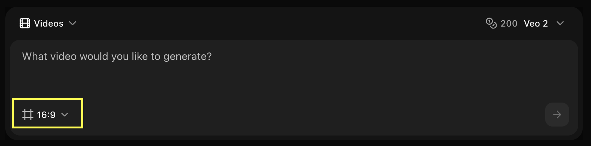
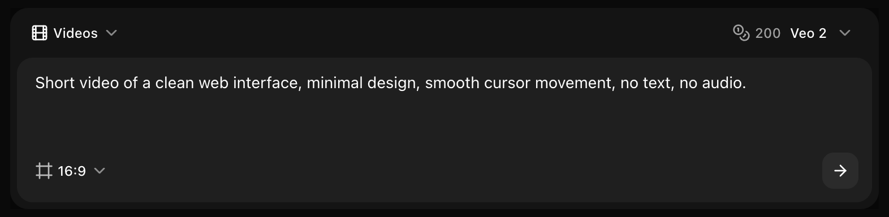
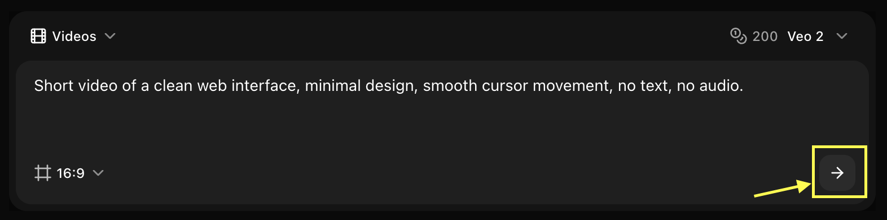

## Overview

Veo 2 creates high-quality videos from text prompts, perfect for marketing, social media, and creative projects.

## Quick Start

Generate videos from text prompts using Zoice’s AI video generation models.

<Steps>
  <Step title="Navigate to New Video">
    Go to the Video Generator tool by clicking on **New Video**.
    <Frame>
      
    </Frame>
  </Step>

  <Step title="Select Veo 2 Model">
    Choose **Veo 2** from the model selector.
    <Frame>
      
    </Frame>
  </Step>

  <Step title="Configure Settings for Video">
    Set the dimensions and resolution for your video output.
    <Frame>
      
    </Frame>
  </Step>

  <Step title="Write Your Text Prompt">
    Enter a description of the scene and action you want to create in the prompt box.
    <Frame>
      
    </Frame>
  </Step>

  <Step title="Click on Generate">
    Click on the **Generate** button to start generating your video.
    <Frame>
      
    </Frame>
  </Step>

  <Step title="Download">
    Save your generated video.
  </Step>
</Steps>

## Best Practices

- Include camera movement keywords
- Describe action clearly
- Specify duration context
- Use cinematic terms

## Next Steps

<CardGroup cols={2}>
  <Card title="Model Overview" icon="info" href="/ai-models/video/veo-2/overview">
    Learn about Veo 2
  </Card>
  <Card title="Prompt Guide" icon="book" href="/prompt-guide/introduction">
    Master video prompts
  </Card>
</CardGroup>
