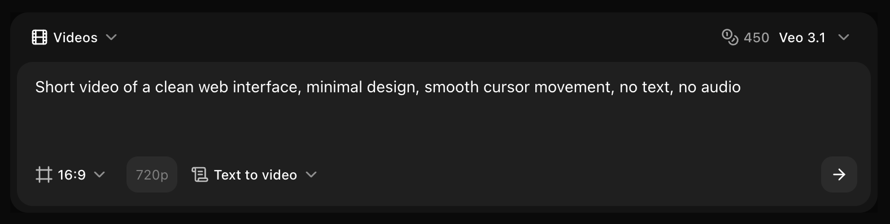
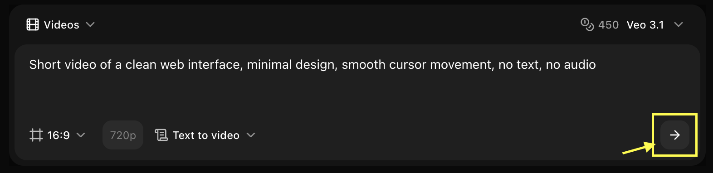

## Overview

Veo 3.0 Fast provides professional-quality videos with faster generation times for quick content creation.

## Quick Start

Generate videos from text prompts using Zoice’s AI video generation models.

<Steps>
  <Step title="Navigate to New Video">
    Go to the Video Generator tool by clicking on **New Video**.
    <Frame>
      
    </Frame>
  </Step>

  <Step title="Select Veo 3.0 Fast Model">
    Choose **Veo 3.0 Fast** from the model selector.
    <Frame>
      
    </Frame>
  </Step>

  <Step title="Configure Settings for Video">
    Set dimensions, resolution, and choose **Text to Video** mode.
    <Frame>
      
    </Frame>
  </Step>

  <Step title="Write Your Text Prompt">
    Enter a description of the scene and action you want to create in the prompt box.
    <Frame>
      
    </Frame>
  </Step>

  <Step title="Click on Generate">
    Click on the **Generate** button to begin creating your video.
    <Frame>
      
    </Frame>
  </Step>

  <Step title="Download">
    Save your generated video.
  </Step>
</Steps>

## Best Practices

- Clear descriptions
- Include camera work
- Leverage speed

## Next Steps

<CardGroup cols={2}>
  <Card title="Model Overview" icon="info" href="/ai-models/video/veo-3-0-fast/overview">
    Learn about Veo 3.0 Fast
  </Card>
  <Card title="Prompt Guide" icon="book" href="/prompt-guide/introduction">
    Master prompts
  </Card>
</CardGroup>
