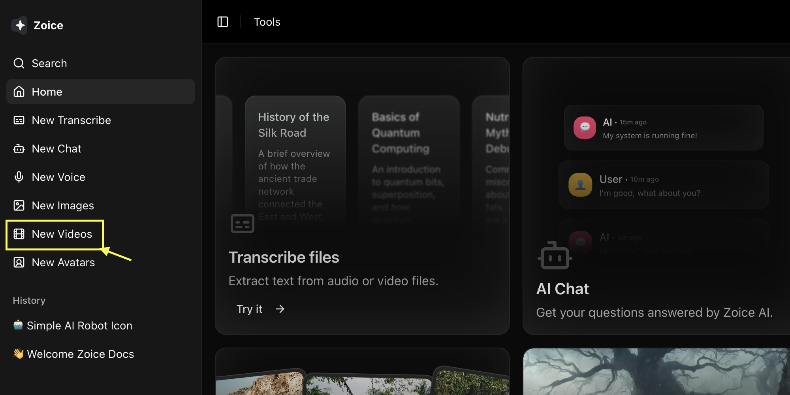
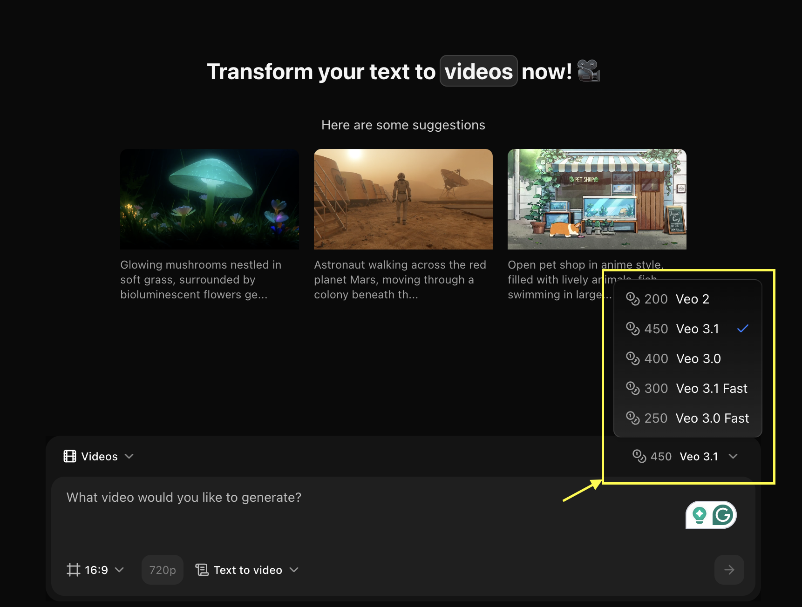
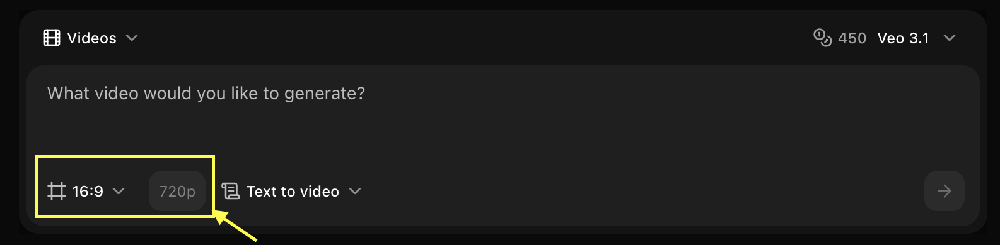
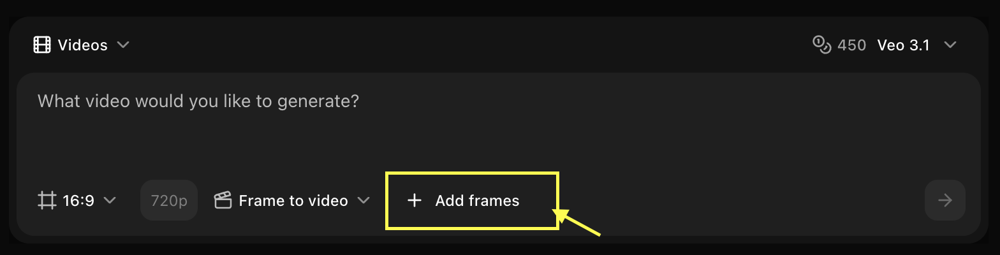
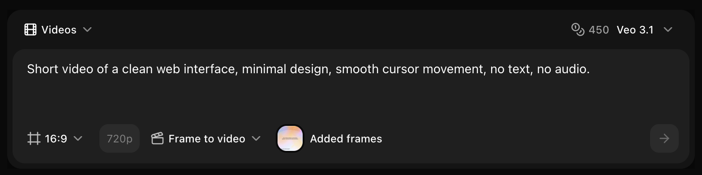
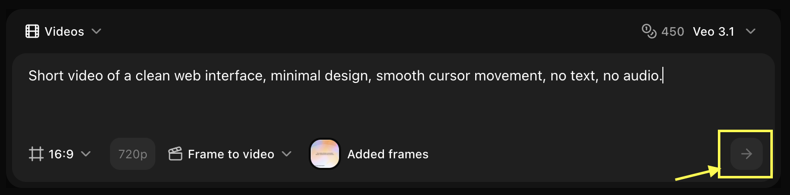

## Overview

Veo 3.1's Frame to Video mode allows you to upload multiple frames and generate smooth, high-quality video transitions between them, perfect for creating professional animations and controlled video sequences.

## Quick Start

Upload multiple frames and let the AI generate smooth transitions and motion between them to create a cohesive, premium-quality video.

<Steps>
  <Step title="Navigate to New Video">
    Go to the Video Generator tool by clicking on **New Video**.
    <Frame>
      
    </Frame>
  </Step>

  <Step title="Select Veo 3.1 Model">
    Choose **Veo 3.1** from the model selector.
    <Frame>
      
    </Frame>
  </Step>

  <Step title="Configure Settings for Video">
    Set dimensions, resolution, and choose **Frame to Video** mode.
    <Frame>
      
    </Frame>
  </Step>

  <Step title="Upload Your Frames">
    Upload multiple frames in sequence that you want to animate.
    <Frame>
      
    </Frame>
  </Step>

  <Step title="Write Your Text Prompt (Optional)">
    Add a description to guide the animation style and motion between frames.
    <Frame>
      
    </Frame>
  </Step>

  <Step title="Click on Generate">
    Click on the **Generate** button to begin creating your video.
    <Frame>
      
    </Frame>
  </Step>

  <Step title="Download">
    Save your generated video.
  </Step>
</Steps>

## Best Practices

- Use consistent frame sizes and aspect ratios
- Maintain visual continuity between frames
- Add descriptive prompts for better transitions
- Specify desired animation style
- Consider timing and pacing

## Next Steps

<CardGroup cols={2}>
  <Card title="Text to Video" icon="text" href="/ai-models/video/veo-3-1/text-to-video">
    Generate from text only
  </Card>
  <Card title="Image to Video" icon="image" href="/ai-models/video/veo-3-1/image-to-video">
    Generate from reference image
  </Card>
</CardGroup>
