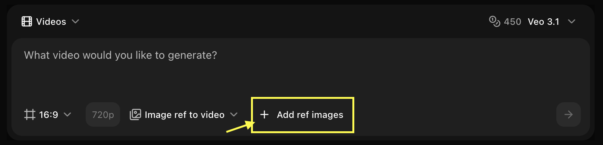
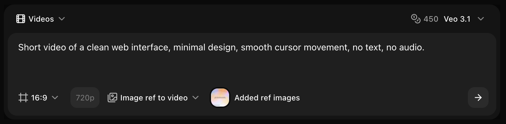
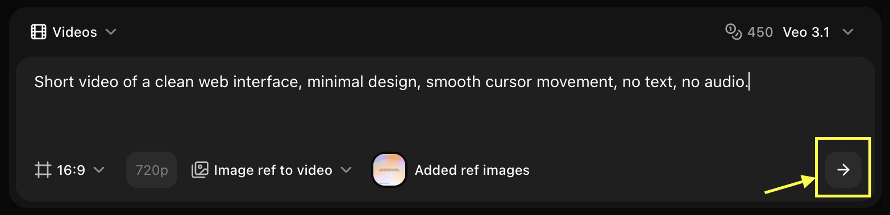

## Overview

Veo 3.1 supports reference images for precise style and content control, perfect for branded content and consistent visual styles.

## Quick Start

The AI analyzes your reference image to understand composition, style, and subject matter, then generates a video with the motion and action described in your prompt.

<Steps>
  <Step title="Navigate to New Video">
    Go to the Video Generator tool by clicking on **New Video**.
    <Frame>
      
    </Frame>
  </Step>

  <Step title="Select Veo 3.1 Model">
    Choose **Veo 3.1** from the model selector.
    <Frame>
      
    </Frame>
  </Step>

  <Step title="Configure Settings for Video">
    Set dimensions, resolution, and choose **Image Ref to Video** mode.
    <Frame>
      
    </Frame>
  </Step>

  <Step title="Add Reference Image">
    Upload the image you want to use as a base for your video.
    <Frame>
      
    </Frame>
  </Step>

  <Step title="Write Your Text Prompt">
    Enter a description of the scene and action you want the AI to generate.
    <Frame>
      
    </Frame>
  </Step>

  <Step title="Click on Generate">
    Click on the **Generate** button to begin creating your video.
    <Frame>
      
    </Frame>
  </Step>

  <Step title="Download">
    Save your generated video.
  </Step>
</Steps>

## Best Practices

- Use high-quality references
- Describe desired motion
- Specify camera work
- Set appropriate strength

## Next Steps

<CardGroup cols={2}>
  <Card title="Text to Video" icon="text" href="/ai-models/video/veo-3-1/text-to-video">
    Generate without reference
  </Card>
  <Card title="Video Generator Tool" icon="video" href="/features/video-generator">
    Back to the main Video Generator guide
  </Card>
</CardGroup>
