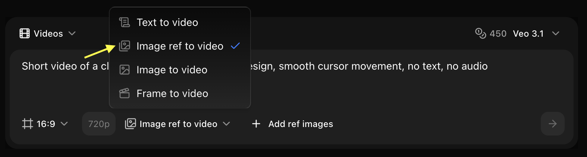

## Overview

Veo 3.1 supports reference images for precise style and content control, perfect for branded content and consistent visual styles.

## Quick Start

The AI analyzes your reference image to understand composition, style, colors, and subject matter, then generates a video that incorporates these elements while adding the motion and action described in your prompt.

<Steps>
  <Step title="Navigate to New Video">
    Go to the Video Generator tool in your Zoice dashboard by clicking on **New Video**.
    <Frame>
      
    </Frame>
  </Step>

  <Step title="Select Veo 3.1 Model">
    Choose **Veo 3.1** from the model selector based on your project needs.
    <Frame>
      
    </Frame>
  </Step>

  <Step title="Select Size and Resolution">
    Configure the dimensions and quality settings for your video output.
    <Frame>
      
    </Frame>
  </Step>

  <Step title="Select Image Ref to Video">
    Choose the **Image Ref to Video** mode to generate dynamic content guided by your reference images.
    <Frame>
      
    </Frame>
  </Step>

  <Step title="Add Reference Image">
    Click on **Add Ref Images** to select and upload the image you want to use as a base for your video.
    <Frame>
      
    </Frame>
  </Step>

  <Step title="Write Your Text Prompt">
    Enter a detailed description of the scene and action you want the AI to generate based on your reference image.
    <Frame>
      
    </Frame>
  </Step>

  <Step title="Click on Generate">
    Click on the **Generate** button to begin creating your video.
    <Frame>
      
    </Frame>
  </Step>
</Steps>

## Best Practices

- Use high-quality references
- Describe desired motion
- Specify camera work
- Set appropriate strength

## Next Steps

<CardGroup cols={2}>
  <Card title="Text Prompts" icon="text" href="/ai-models/video/veo-3-1/text-prompt">
    Generate without reference
  </Card>
  <Card title="Model Overview" icon="info" href="/ai-models/video/veo-3-1/overview">
    Learn more
  </Card>
</CardGroup>
