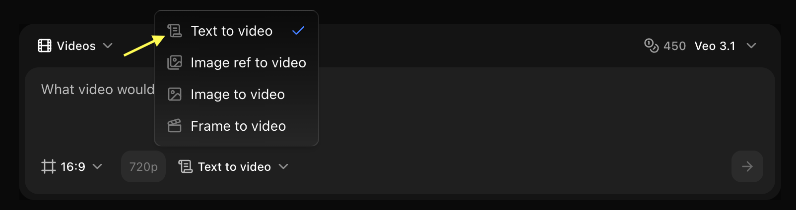

## Overview

Veo 3.1 delivers enhanced video quality with improved motion and better prompt understanding for professional video creation.

## Quick Start

Generate videos from text prompts using Zoice’s AI video generation models.

<Steps>
  <Step title="Navigate to New Video">
    Go to the Video Generator tool in your Zoice dashboard by clicking on **New Video**.
    <Frame>
      
    </Frame>
  </Step>

  <Step title="Select Veo 3.1 Model">
    Choose **Veo 3.1** from the model selector based on your project needs.
    <Frame>
      
    </Frame>
  </Step>

  <Step title="Select Size and Resolution">
    Configure the dimensions and quality settings for your video output.
    <Frame>
      
    </Frame>
  </Step>

  <Step title="Select Text to Video">
    Choose the **Text to Video** mode to generate dynamic content from your text descriptions.
    <Frame>
      
    </Frame>
  </Step>

  <Step title="Write Your Text Prompt">
    Enter a detailed description of the scene and action you want to create in the prompt box.
    <Frame>
      
    </Frame>
  </Step>

  <Step title="Click on Generate">
    Click on the **Generate** button to begin creating your video.
    <Frame>
      
    </Frame>
  </Step>
</Steps>

## Best Practices

- Use detailed scene descriptions
- Include camera movements
- Specify lighting and mood
- Describe action clearly

## Next Steps

<CardGroup cols={2}>
  <Card title="Model Overview" icon="info" href="/ai-models/video/veo-3-1/overview">
    Learn about Veo 3.1
  </Card>
  <Card title="Prompt Guide" icon="book" href="/prompt-guide/introduction">
    Master video prompts
  </Card>
</CardGroup>
