## What are Custom Avatars?

Custom avatars are AI-generated characters created from your uploaded photos. They maintain the likeness of the person in the photo while adding realistic animations, lip-sync, and expressions for video presentations.

## Benefits of Custom Avatars

- **Personal Branding**: Use your own face or brand representatives
- **Authenticity**: Real people, AI-powered animation
- **Brand Consistency**: Maintain visual brand identity
- **Professional Presence**: Create polished video content
- **Flexibility**: Multiple team members as avatars
- **Reusable**: Create once, use for multiple videos

## How It Works

Describe your ideal avatar using text prompts, and our AI will generate a 3D avatar model matching your description. You have full control over appearance, style, clothing, and characteristics.

## Getting Started

<Steps>
  <Step title="Navigate to New Avatar">
    Go to the **New Avatar** section in the left menu of your Zoice dashboard.
    <Frame>
      
    </Frame>
  </Step>

  <Step title="Manage Custom Avatar">
    Select the **Manage Custom Avatar** option to start creating your personalized character.
    <Frame>
      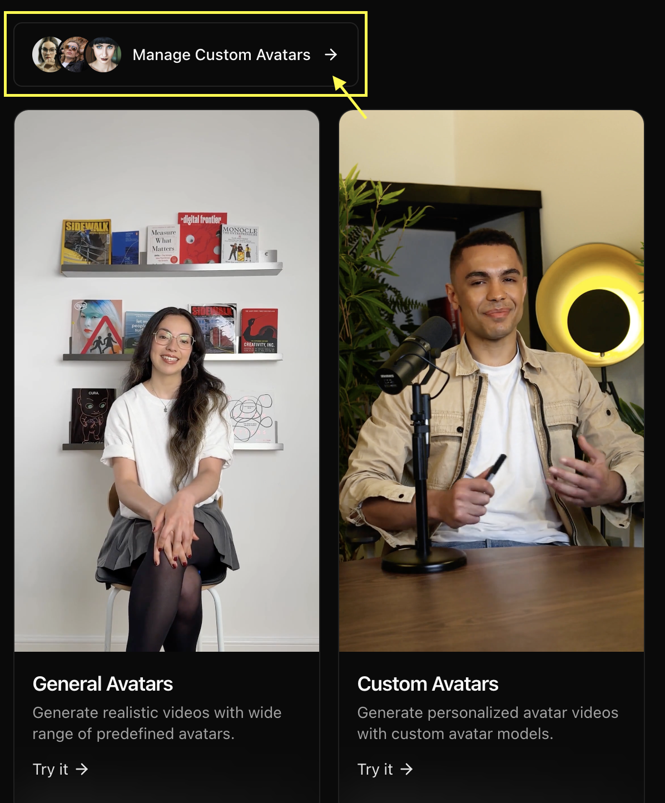
    </Frame>
  </Step>

  <Step title="Create New">
    Click on the **Create New** button to begin the avatar creation process.
    <Frame>
      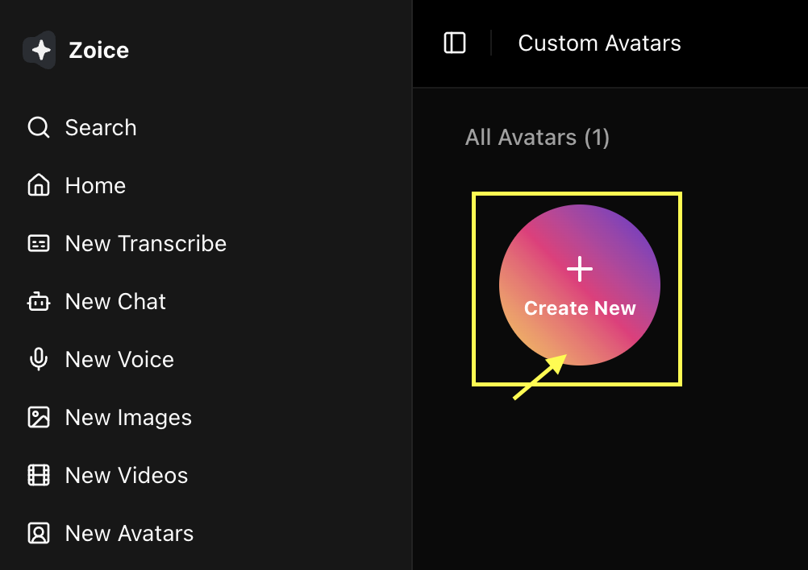
    </Frame>
  </Step>

  <Step title="Choose Creation Method">
    You have two options to create your avatar's base image:
    - **Upload Image**: Use your own high-quality, front-facing photo.
    <Frame>
      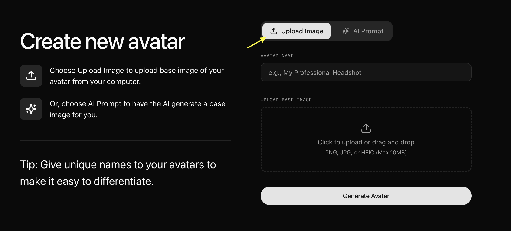
    </Frame>
    - **Generate HD Image**: Write a text prompt to have AI generate a high-definition image for your avatar.
    <Frame>
      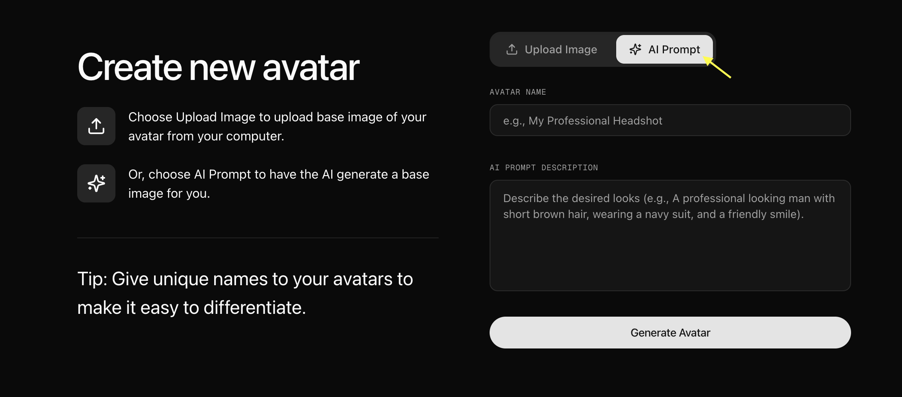
    </Frame>
  </Step>

  <Step title="Name Your Avatar">
    In both cases, enter a descriptive name for your avatar to easily identify it in your gallery later.
    <Frame>
      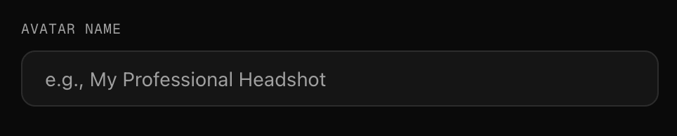
    </Frame>
  </Step>

  <Step title="Click on Generate Avatar">
    Once you've added or generated your image, click on **Generate Avatar**. You will now see your avatar saved in your gallery with that image.
    <Frame>
      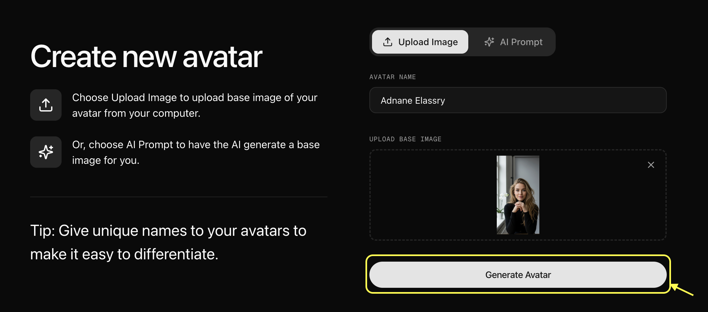
    </Frame>
    In the other tab you can generate avatar using text prompt.
    <Frame>
      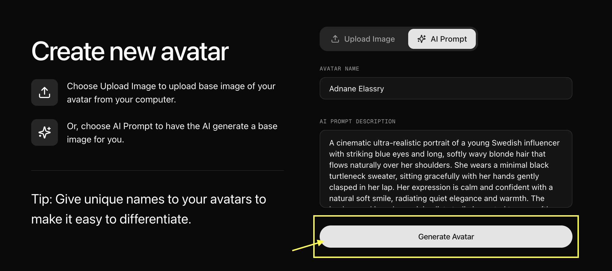
    </Frame>
  </Step>

  <Step title="Select Saved Avatar">
    Click on your saved avatar from the custom avatar gallery to select it.
    <Frame>
      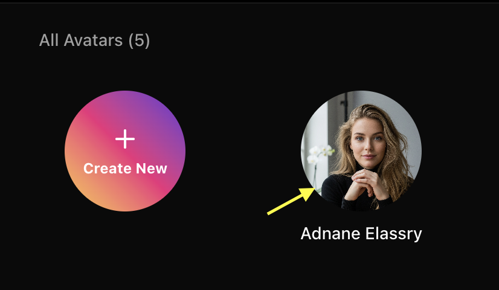
    </Frame>
  </Step>

  <Step title="Navigate to Settings">
    Once selected, click to navigate to the settings to begin your customization.
    <Frame>
      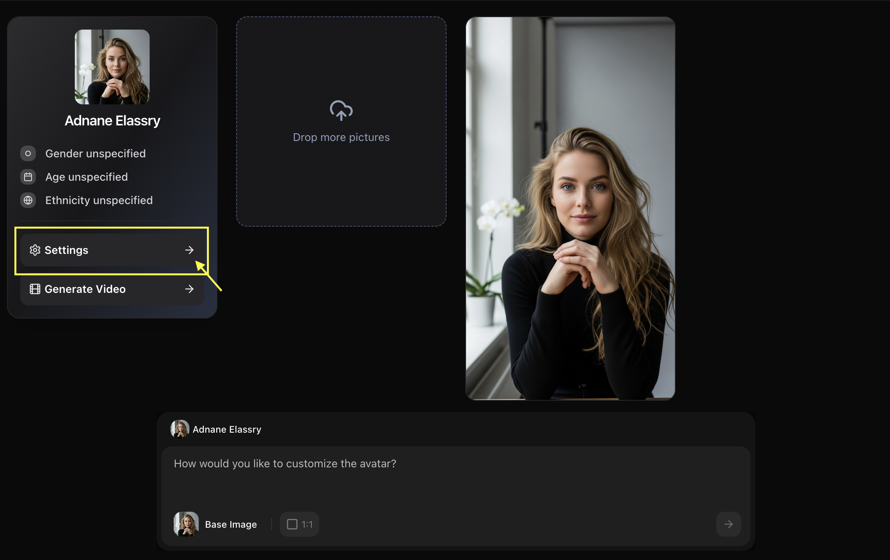
    </Frame>
  </Step>

  <Step title="Update Profile Details">
    Fine-tune your avatar's profile by adjusting settings like **Age**, **Ethnicity**, and **Gender** to match your vision.
    <Frame>
      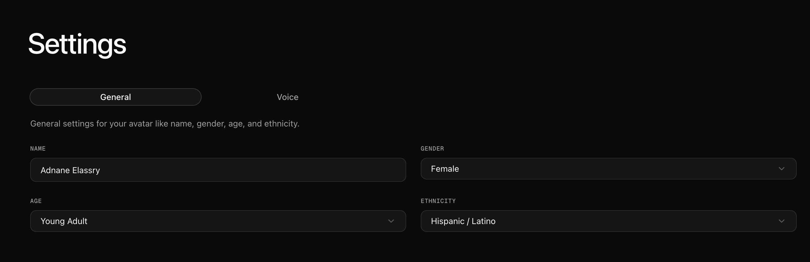
    </Frame>
  </Step>

  <Step title="Go Back to New Avatar Section and Select Custom Avatar">
    Go back to the **New Avatar** section and select **Custom Avatar**. 
    <Frame>
      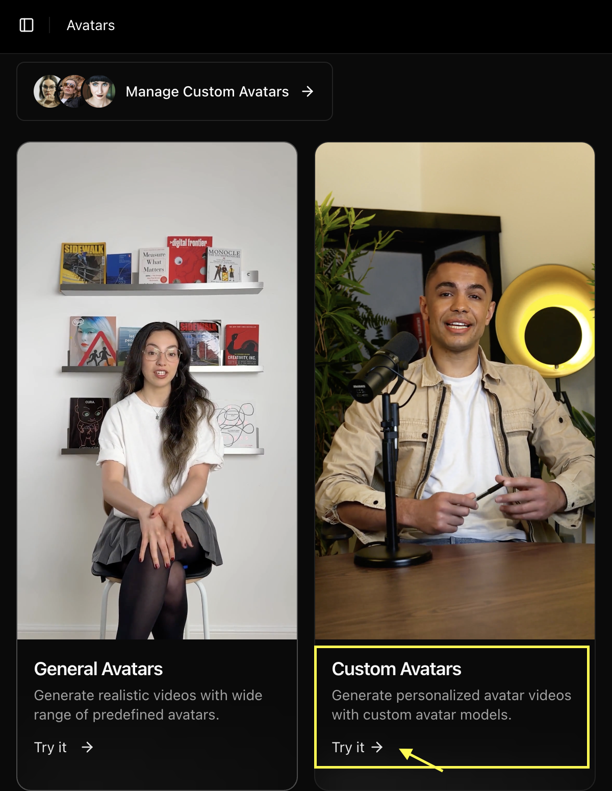
    </Frame>
    From here:
    - **Select Base Image**: Choose your newly customized avatar image from the gallery.
    <Frame>
      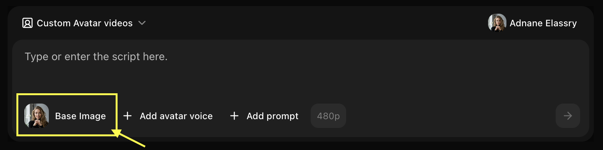
    </Frame>
    - **Click Add Voice**: Select a voice or upload your own 1-minute voice sample if preferred.
    <Frame>
      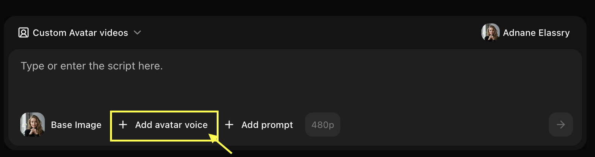
    </Frame>
    - **Upload Voice Sample**: Upload your own 1-minute voice sample if preferred.
    <Frame>
      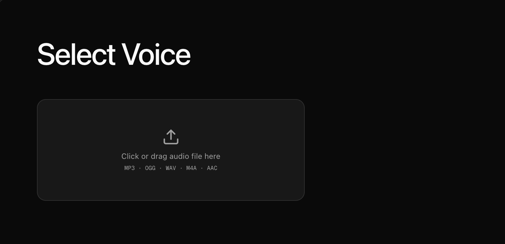
    </Frame>
    - **Add Action**: Define the action you want your avatar to perform like greeting, waving, etc.
    <Frame>
      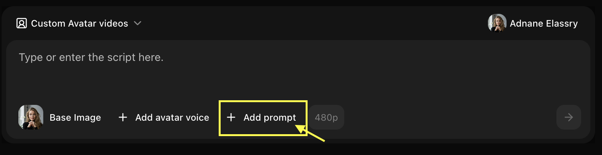
    </Frame>
    - **Resolution**: Choose your preferred video resolution.
    <Frame>
      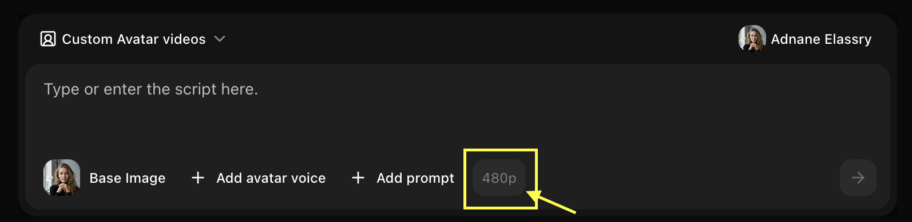
    </Frame>
    - **Write Script**: Enter the text you want your avatar to speak in the script box.
    <Frame>
      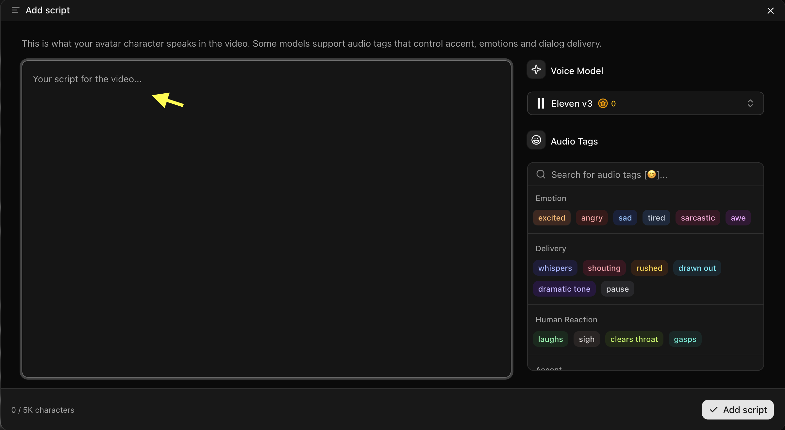
    </Frame>
    - **Generate**: Click on **Generate** to create your final video.
    <Frame>
      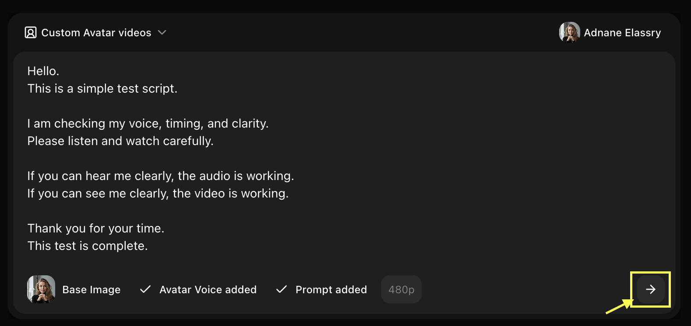
    </Frame>
  </Step>
</Steps>

## Writing Effective Prompts

### Basic Structure

A good avatar prompt includes:
- **Demographics**: Age, gender, ethnicity
- **Appearance**: Hair color/style, facial features, build
- **Style**: Clothing, accessories, overall aesthetic
- **Mood**: Expression, demeanor, personality

### Example Prompts

<CodeGroup>
```text Professional
A professional woman in her 30s with shoulder-length brown hair, wearing a navy blue blazer, friendly smile, confident posture, modern office background
```

```text Creative
A young creative artist in their 20s with colorful dyed hair, casual streetwear, artistic tattoos, expressive features, studio background
```

```text Educational
A friendly teacher in their 40s with glasses, warm smile, professional attire, approachable demeanor, classroom setting
```

```text Character
A futuristic sci-fi character with sleek silver hair, high-tech outfit, glowing accents, confident expression, digital background
```
</CodeGroup>

## Customization Options

### Appearance Controls
- **Age Range**: Child, teen, young adult, middle-aged, senior
- **Gender**: Male, female, non-binary
- **Ethnicity**: Various ethnic backgrounds available
- **Hair**: Color, length, style
- **Facial Features**: Eyes, nose, mouth, facial structure
- **Build**: Body type and proportions

### Style Options
- **Realistic**: Photorealistic human avatars
- **Stylized**: Semi-realistic with artistic touches
- **Cartoon**: Animated, cartoon-style characters
- **Anime**: Anime/manga-inspired style

### Clothing & Accessories
- **Professional**: Business attire, formal wear
- **Casual**: Everyday clothing, streetwear
- **Creative**: Artistic, unique outfits
- **Themed**: Specific themes or costumes

### Background & Setting
- **Office**: Professional workspace
- **Studio**: Neutral or colored backgrounds
- **Outdoor**: Natural settings
- **Custom**: Upload your own background

## Use Cases

<CardGroup cols={2}>
  <Card title="Brand Mascots" icon="star">
    Create unique brand representative avatars
  </Card>
  <Card title="Virtual Presenters" icon="presentation">
    Generate presenters for videos and webinars
  </Card>
  <Card title="Game Characters" icon="gamepad">
    Design characters for games or interactive content
  </Card>
  <Card title="Social Media" icon="hashtag">
    Create consistent avatar personas for platforms
  </Card>
</CardGroup>

## Best Practices

<AccordionGroup>
  <Accordion title="Prompt Writing Tips">
    - Be specific about key features
    - Include style preferences
    - Mention clothing and accessories
    - Describe the mood or expression
    - Specify background if important
  </Accordion>

  <Accordion title="Iteration Strategy">
    - Start with a basic description
    - Generate and review
    - Refine prompt based on results
    - Adjust specific details
    - Test different style options
  </Accordion>

  <Accordion title="Consistency">
    - Save successful prompts for reuse
    - Use similar descriptions for character consistency
    - Document your avatar specifications
    - Create style guides for brand avatars
  </Accordion>
</AccordionGroup>

<Tip>
Start with simple descriptions and add details gradually. Too many details in one prompt can sometimes conflict.
</Tip>

## Advanced Features

### Voice Integration
Combine your text-generated avatar with:
- Custom voice selection
- Voice cloning for unique voices
- Emotion and tone control
- Multi-language support

### Animation Control
- **Expression Intensity**: Subtle to expressive
- **Movement Style**: Static, moderate, or dynamic
- **Gesture Options**: Hand movements and body language
- **Camera Angles**: Front, slight angle, or dynamic

## Limitations

- Avatar generation may take 30-60 seconds
- Very complex or contradictory prompts may produce unexpected results
- Extreme or unrealistic features may not render accurately
- Some style combinations may not be available

<Warning>
Generated avatars should not be used to impersonate real individuals without consent.
</Warning>

## Next Steps

<CardGroup cols={2}>
  <Card title="Image to Avatar" icon="image" href="/features/ai-avatar/image-to-avatar">
    Create avatars from photos instead
  </Card>
  <Card title="Prompt Guide" icon="book" href="/prompt-guide/introduction">
    Master prompt engineering techniques
  </Card>
</CardGroup>
