## What are Custom Avatars?

Custom avatars are AI-generated characters created from your uploaded photos. They maintain the likeness of the person in the photo while adding realistic animations, lip-sync, and expressions for video presentations.

## Benefits of Custom Avatars

- **Personal Branding**: Use your own face or brand representatives
- **Authenticity**: Real people, AI-powered animation
- **Brand Consistency**: Maintain visual brand identity
- **Professional Presence**: Create polished video content
- **Flexibility**: Multiple team members as avatars
- **Reusable**: Create once, use for multiple videos

## How It Works

Describe your ideal avatar using text prompts, and our AI will generate a 3D avatar model matching your description. You have full control over appearance, style, clothing, and characteristics.

## Getting Started

<Steps>
<Step title="Login to Zoice">
Log in to your account at [Zoice.com](https://zoice.com).
<Frame>
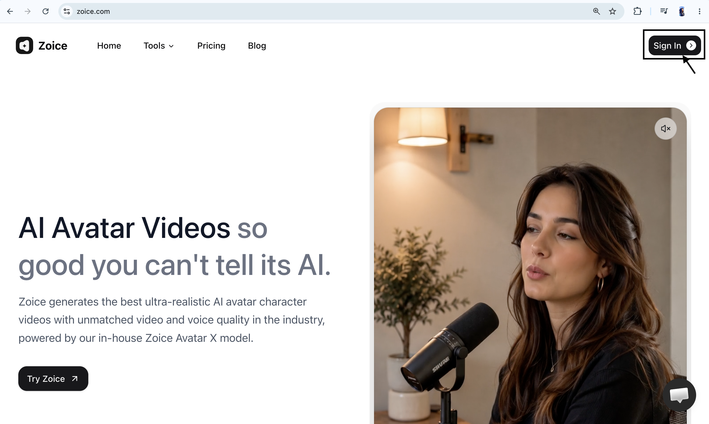
</Frame>
</Step>

<Step title="Navigate to All Tools">
Click on **See all tools** and scroll down to locate the video creation features.
<Frame>
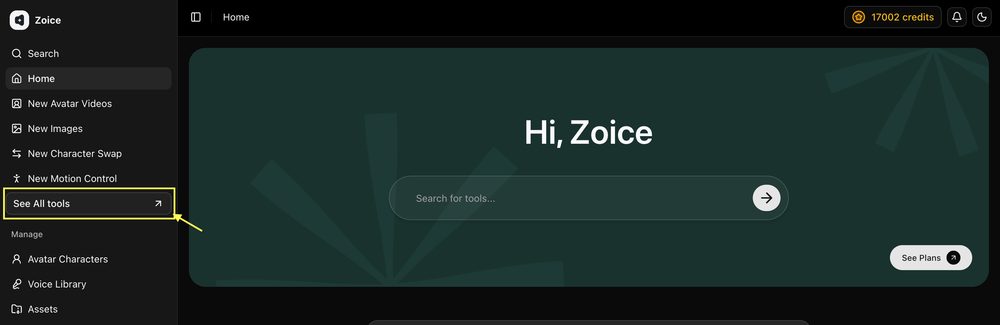
</Frame>
</Step>

<Step title="Select AI Avatar Videos">
Find **AI Avatar Videos** and click on **Generate** to proceed.
<Frame>
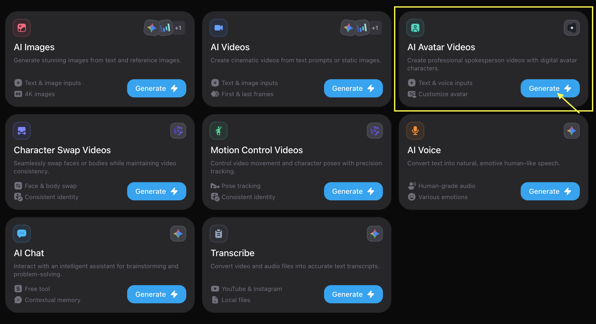
</Frame>
</Step>

<Step title="Choose Avatar Character">
On the options screen, locate **Avatar Character** and click on it.
<Frame>
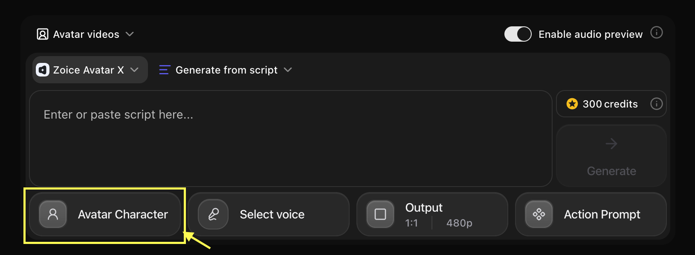
</Frame>
</Step>

<Step title="Create New Avatar">
Click on the **Create New** button to initiate the avatar creation wizard.
<Frame>
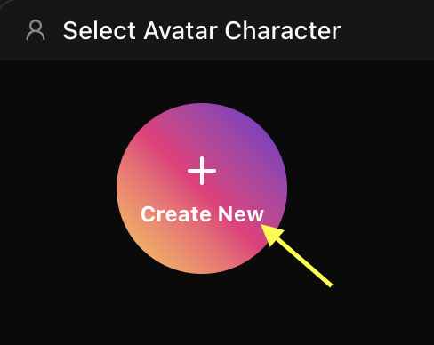
</Frame>
</Step>

<Step title="Upload or Generate Avatar Image">
You have two options to set up your avatar image:

* **Upload Image**: Enter a name and upload your front-facing portrait image.
<Frame>
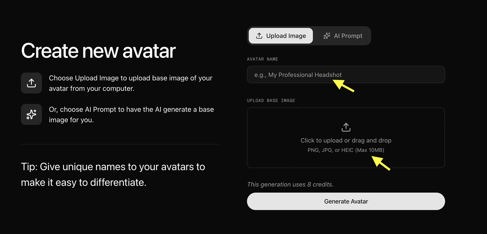
</Frame>

* **AI Prompt Generation**: Toggle the AI prompt option, name your avatar, and enter a detailed prompt to generate an image.
<Frame>
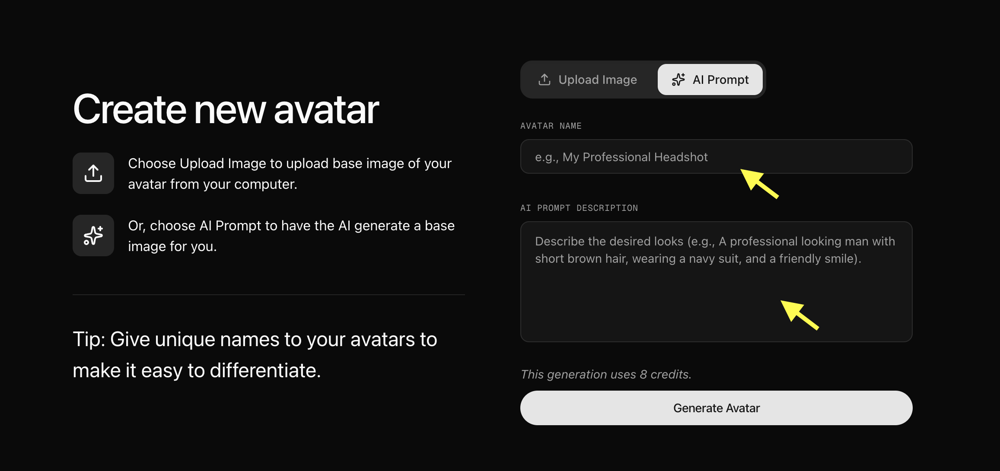
</Frame>
</Step>

<Step title="Configure Avatar Settings">
Click on **Avatar Settings** to customize details for a more realistic output. Once customized, you can add more images or generate variations from the base image.
<Frame>
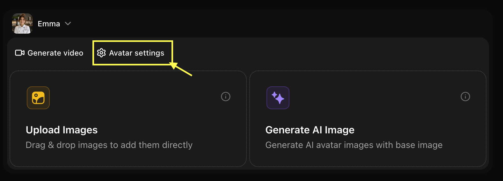
</Frame>
</Step>

<Step title="Adjust General Settings">
In the **General Settings** tab, fill in the basic details such as age, ethnicity, and gender.
<Frame>
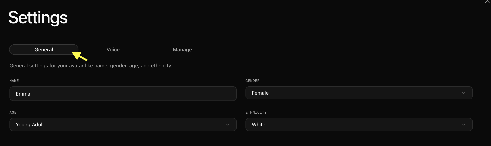
</Frame>
</Step>

<Step title="Add a Custom Voice">
In the voice settings tab, upload or record your own voice to set it as the default voice for your custom avatar.
<Frame>
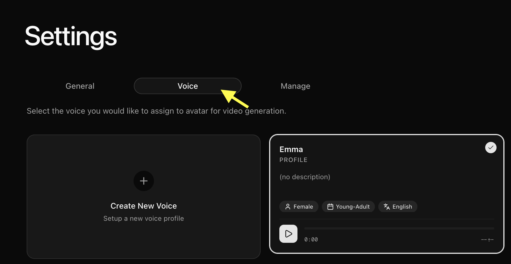
</Frame>
</Step>

<Step title="Manage Avatar Options">
Under the **Manage** tab, you can manage your avatar options or delete the avatar to start fresh if needed.
<Frame>
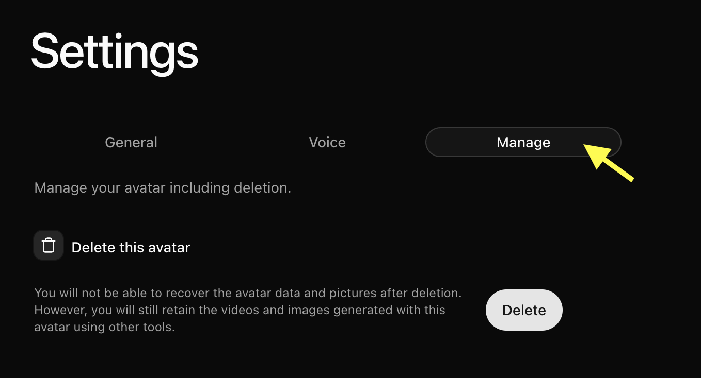
</Frame>
</Step>

<Step title="Navigate to Video Generation">
Go back to the previous screen and click **Generate Video** to open the advanced video settings panel.
<Frame>
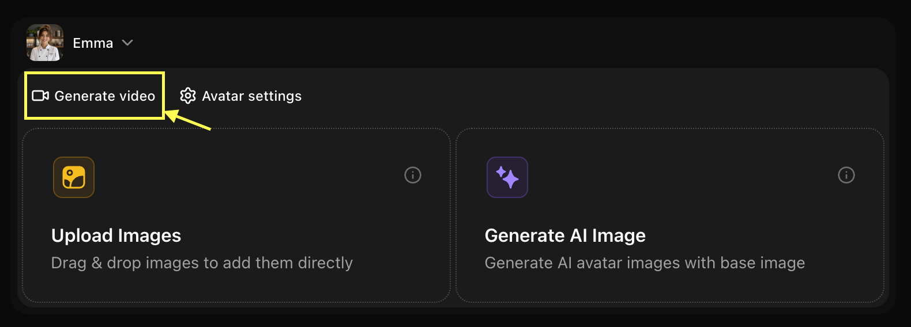
</Frame>

> [!TIP]
> **Audio Preview Feature**: Use the audio preview in the top-right corner to listen to the generated speech before creating the full video, helping you conserve credits.
</Step>

<Step title="Set Up Script and Expressions">
Add your text script, select your voice model, and configure emotions, delivery style, human reactions, and accent tags.
<Frame>
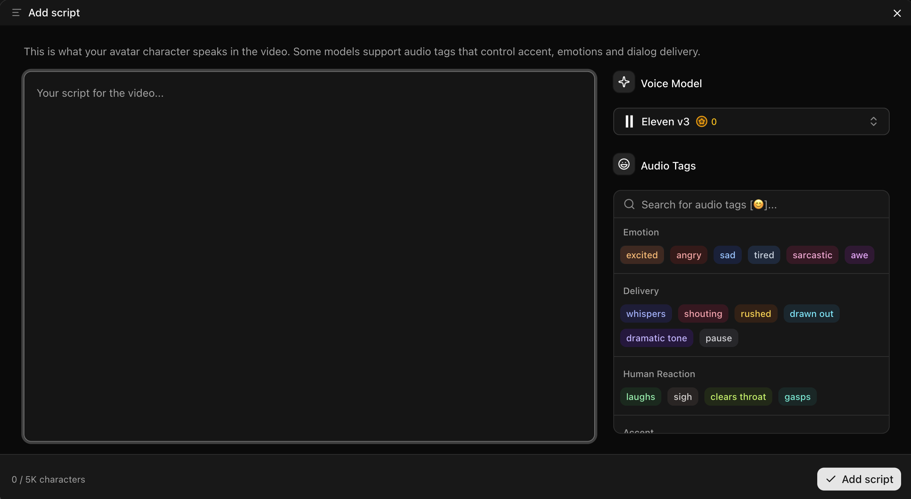
</Frame>
</Step>

<Step title="Select Voice Model">
Select your uploaded voice, import a public voice, or add a new one by clicking the **New** button.
<Frame>
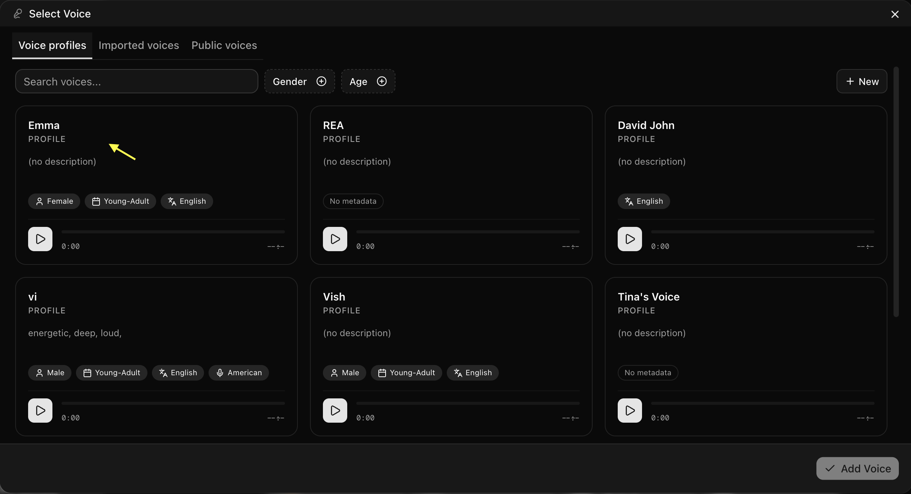
</Frame>
</Step>

<Step title="Choose Aspect Ratio and Resolution">
Choose the desired aspect ratio and resolution for your output video.
<Frame>
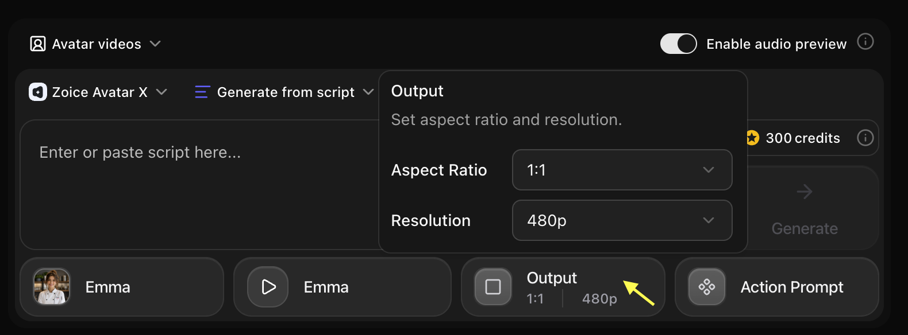
</Frame>
</Step>

<Step title="Define Avatar Action Prompt">
Click and select a preset action suitable for your avatar, or type a custom description for the avatar's movement.
</Step>

<Step title="Generate the Video">
Verify all settings and click **Generate**. Wait a few minutes for the system to process and deliver your custom AI avatar video!
</Step>
</Steps>

## Writing Effective Prompts

### Basic Structure

A good avatar prompt includes:
- **Demographics**: Age, gender, ethnicity
- **Appearance**: Hair color/style, facial features, build
- **Style**: Clothing, accessories, overall aesthetic
- **Mood**: Expression, demeanor, personality

### Example Prompts

<CodeGroup>
```text Professional
A professional woman in her 30s with shoulder-length brown hair, wearing a navy blue blazer, friendly smile, confident posture, modern office background
```

```text Creative
A young creative artist in their 20s with colorful dyed hair, casual streetwear, artistic tattoos, expressive features, studio background
```

```text Educational
A friendly teacher in their 40s with glasses, warm smile, professional attire, approachable demeanor, classroom setting
```

```text Character
A futuristic sci-fi character with sleek silver hair, high-tech outfit, glowing accents, confident expression, digital background
```
</CodeGroup>

## Customization Options

### Appearance Controls
- **Age Range**: Child, teen, young adult, middle-aged, senior
- **Gender**: Male, female, non-binary
- **Ethnicity**: Various ethnic backgrounds available
- **Hair**: Color, length, style
- **Facial Features**: Eyes, nose, mouth, facial structure
- **Build**: Body type and proportions

### Style Options
- **Realistic**: Photorealistic human avatars
- **Stylized**: Semi-realistic with artistic touches
- **Cartoon**: Animated, cartoon-style characters
- **Anime**: Anime/manga-inspired style

### Clothing & Accessories
- **Professional**: Business attire, formal wear
- **Casual**: Everyday clothing, streetwear
- **Creative**: Artistic, unique outfits
- **Themed**: Specific themes or costumes

### Background & Setting
- **Office**: Professional workspace
- **Studio**: Neutral or colored backgrounds
- **Outdoor**: Natural settings
- **Custom**: Upload your own background

## Use Cases

<CardGroup cols={2}>
<Card title="Brand Mascots" icon="star">
Create unique brand representative avatars
</Card>
<Card title="Virtual Presenters" icon="presentation">
Generate presenters for videos and webinars
</Card>
<Card title="Game Characters" icon="gamepad">
Design characters for games or interactive content
</Card>
<Card title="Social Media" icon="hashtag">
Create consistent avatar personas for platforms
</Card>
</CardGroup>

## Best Practices

<AccordionGroup>
<Accordion title="Prompt Writing Tips">
- Be specific about key features
- Include style preferences
- Mention clothing and accessories
- Describe the mood or expression
- Specify background if important
</Accordion>

<Accordion title="Iteration Strategy">
- Start with a basic description
- Generate and review
- Refine prompt based on results
- Adjust specific details
- Test different style options
</Accordion>

<Accordion title="Consistency">
- Save successful prompts for reuse
- Use similar descriptions for character consistency
- Document your avatar specifications
- Create style guides for brand avatars
</Accordion>
</AccordionGroup>

<Tip>
Start with simple descriptions and add details gradually. Too many details in one prompt can sometimes conflict.
</Tip>

## Advanced Features

### Voice Integration
Combine your text-generated avatar with:
- Custom voice selection
- Voice cloning for unique voices
- Emotion and tone control
- Multi-language support

### Animation Control
- **Expression Intensity**: Subtle to expressive
- **Movement Style**: Static, moderate, or dynamic
- **Gesture Options**: Hand movements and body language
- **Camera Angles**: Front, slight angle, or dynamic

## Limitations

- Avatar generation may take 30-60 seconds
- Very complex or contradictory prompts may produce unexpected results
- Extreme or unrealistic features may not render accurately
- Some style combinations may not be available

<Warning>
Generated avatars should not be used to impersonate real individuals without consent.
</Warning>

## Next Steps

<CardGroup cols={2}>
<Card title="Image to Avatar" icon="image" href="/zoice-tools/ai-avatar-generator/image-to-avatar-videos">
Animate your photos into AI presenters
</Card>
<Card title="Stock Avatars" icon="users" href="/features/ai-avatar/stock-avatar">
Explore our library of professional presenters
</Card>
<Card title="Prompt Guide" icon="book" href="/prompt-guide/introduction">
Master generation techniques
</Card>
</CardGroup>