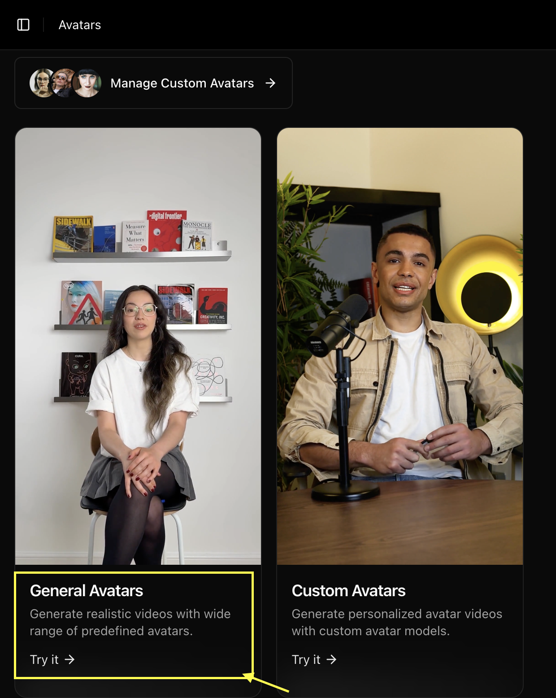
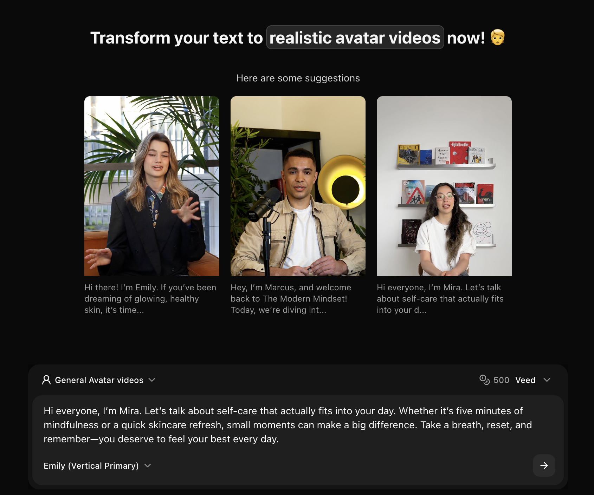
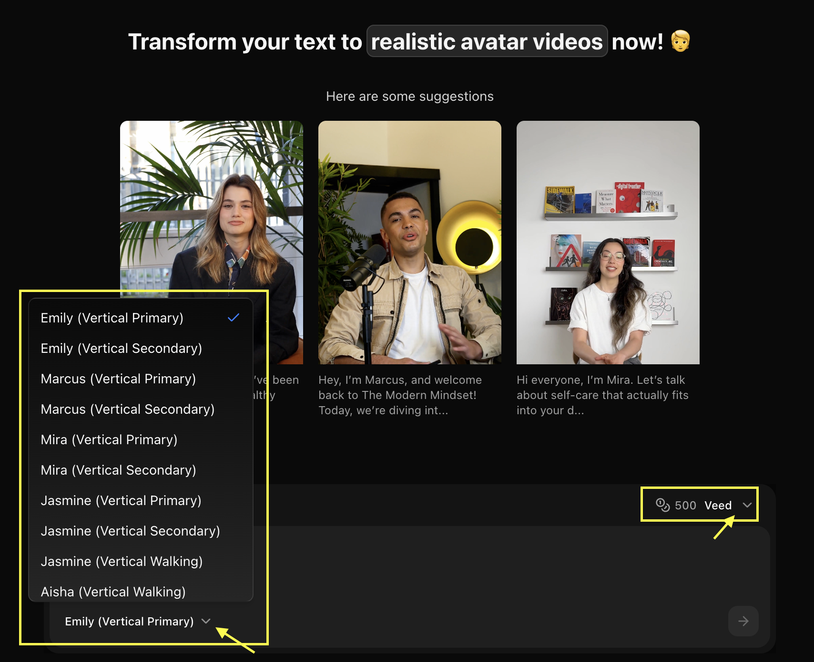
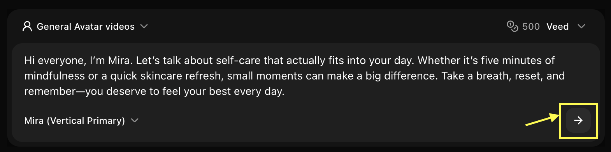

## What are Stock Avatars?

Stock avatars are professionally designed AI characters available in Zoice's library. They come in various ages, genders, ethnicities, and styles, perfect for creating professional video content without using your own image or creating custom avatars.

## Benefits of Stock Avatars

- **Instant Access**: No setup or creation time required
- **Professional Quality**: High-quality, polished avatars
- **Diverse Selection**: Wide range of appearances and styles
- **Cost-Effective**: Lower credit cost than custom avatars
- **Privacy**: No need to upload personal photos
- **Consistency**: Same avatar available for all projects

## Getting Started

<Steps>
  <Step title="Navigate to New Avatar">
    Navigate to the new avatar page in your Zoice dashboard.
    <Frame>
      
    </Frame>
  </Step>

  <Step title="Select Avatar Template from Stock Library">
    Browse the stock library and select the professional AI avatar template you want to use for your video.
    <Frame>
      
    </Frame>
  </Step>

  <Step title="Add Your Script">
    Enter the text or script you want your avatar to speak in the text area.
    <Frame>
      
    </Frame>
  </Step>

  <Step title="Select the Stock Avatar and AI Model">
    Choose the perfect voice and AI model to bring your avatar to life.
    <Frame>
      
    </Frame>
  </Step>

  <Step title="Click Generate">
    Click the **Generate** button to create your animated avatar video.
    <Frame>
      
    </Frame>
  </Step>
</Steps>

## Selecting the Perfect Avatar

Choosing the right stock avatar is key to making your video effective. Consider these factors when browsing the library:

- **Role & Persona**: Match the avatar's appearance to the role (e.g., professional, casual, creative).
- **Tone & Mood**: Ensure the avatar's style aligns with the tone of your message.
- **Audience Connection**: Choose a character that your target audience can relate to.
- **Consistency**: Consider using the same avatar for a series of videos to build recognition.

## Professional Use Cases

Stock avatars are ideal for a variety of professional applications:

<CardGroup cols={2}>
  <Card title="Corporate Training" icon="chalkboard-user">
    Deliver consistent training modules and internal communications.
  </Card>
  <Card title="Product Explainers" icon="circle-play">
    Create clear, engaging walkthroughs for your products or services.
  </Card>
  <Card title="Sales Presentations" icon="chart-line">
    Enhance your pitch decks with professional virtual presenters.
  </Card>
  <Card title="Multi-lingual Content" icon="language">
    Easily localize your message by pairing templates with different voices.
  </Card>
</CardGroup>

## Customization Options

### Avatar Settings
- **Animation Style**: Choose from realistic, expressive, or subtle movements
- **Background**: Select or upload custom backgrounds
- **Clothing**: Adjust avatar clothing and appearance
- **Voice**: Add voice narration to your avatar

### Video Settings
- **Resolution**: 720p or 1080p output
- **Duration**: Based on script length (up to 2 minutes)
- **Format**: MP4 video output

## Best Practices

<AccordionGroup>
  <Accordion title="Character Selection">
    - Match accessibility and representation goals
    - Test different avatars for specific brand tones
    - Use the same character for series continuity
  </Accordion>
  
  <Accordion title="Script Pacing">
    - Use punctuation to control natural pauses
    - Keep sentences concise for better lip-sync clarity
    - Preview scenes to ensure timing matches visuals
  </Accordion>
  
  <Accordion title="Voice Matching">
    - Select a voice age and tone that fits the character
    - Adjust speed and pitch for the most natural result
    - Ensure the audio quality matches your production level
  </Accordion>

  <Accordion title="Environment Selection">
    - Choose a background that provides good contrast
    - Match the setting to the avatar's attire
    - Use simple backgrounds for focused messaging
  </Accordion>
</AccordionGroup>

<Tip>
When creating a series, document the specific avatar, voice, and settings used to maintain perfect consistency.
</Tip>

## Licensing & Usage

- **Commercial Rights**: All stock avatars come with commercial usage rights for your projects.
- **Global Reach**: Use characters across any platform or region without additional fees.
- **No Attribution**: You are not required to attribute Zoice when using stock characters.

## Next Steps

<CardGroup cols={2}>
  <Card title="Text to Avatar" icon="text" href="/zoice-tools/ai-avatar-generator/text-to-avatar-videos">
    Create animated avatars from text descriptions
  </Card>
  <Card title="Voice Generator" icon="microphone" href="/zoice-tools/voice-generator/text-to-voice">
    Add professional AI voices to your avatars
  </Card>
  <Card title="Prompt Guide" icon="book" href="/prompt-guide/introduction">
    Master generation techniques
  </Card>
</CardGroup>
