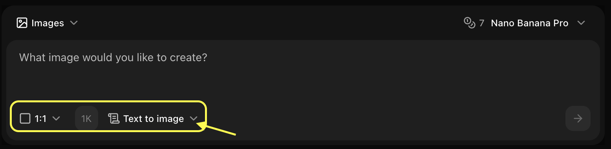
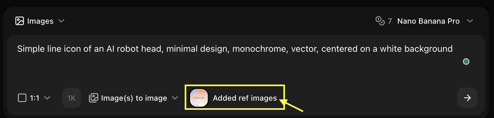
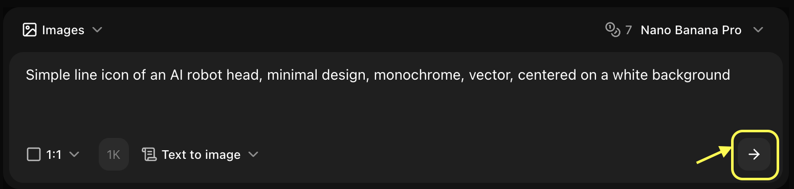

## Key Features

Zoice's Image Generator allows you to create high-quality, unique images from simple text descriptions. Whether you need artwork, graphics, product mockups, or creative visuals, our AI-powered image generation makes it easy to bring your ideas to life.

- **Text-to-Image Generation**: Transform your written descriptions into stunning visuals
- **Image-to-Image Generation**: Use a reference image to guide the style, structure, or composition of your generation (Available for select models)
- **Multiple AI Models**: Choose from various models including Imagen 4, Nano Banana, and more
- **High Resolution**: Generate images up to 4K resolution
- **Style Control**: Fine-tune artistic styles, colors, and composition
- **Fast Processing**: Get your images in seconds

## Use Cases

<CardGroup cols={2}>
  <Card title="Marketing Materials" icon="bullhorn">
    Create eye-catching visuals for social media, ads, and campaigns
  </Card>
  <Card title="Product Design" icon="palette">
    Generate concept art and product mockups
  </Card>
  <Card title="Content Creation" icon="image">
    Produce unique images for blogs, articles, and websites
  </Card>
  <Card title="Creative Projects" icon="wand-magic-sparkles">
    Bring artistic visions to life for personal or professional projects
  </Card>
</CardGroup>

## How It Works
1. **Navigate to New Images**: Go to the Image Generator section in your Zoice dashboard
2. **Select a Model**: Choose the AI model that best fits your needs
3. **Enter Your Prompt**: Describe the image you want to create
4. **Reference Image (Optional)**: Upload an image to guide the AI's generation (Note: Supported in select models)
5. **Customize Settings**: Adjust resolution, style, and other parameters
6. **Generate**: Click generate and watch your image come to life
7. **Download**: Save your creation in high quality

## Getting Started

<Steps>
  <Step title="Navigate to New Images">
    Go to the Image Generator section in your Zoice dashboard
    <Frame>
      
    </Frame>
  </Step>

  <Step title="Select Model">
    Choose the AI model you want to use for your generation
    <Frame>
      
    </Frame>
  </Step>

  <Step title="Configure Settings">
    Set resolution, aspect ratio, and choose generation mode (Text to Image or Image to Image)
    <Frame>
      
    </Frame>
  </Step>

  <Step title="Write Prompt or Upload Reference">
    Tell the AI what you want using text, or upload an image as a reference
    <Frame>
      
    </Frame>
  </Step>

  <Step title="Generate">
    Click the generate button and wait a few seconds
    <Frame>
      
    </Frame>
  </Step>

  <Step title="Download">
    Save your generated image to your device
  </Step>
</Steps>

<Tip>
For best results, be specific in your prompts. Include details about style, colors, composition, and mood.
</Tip>

## Next Steps

<CardGroup cols={2}>
  <Card title="Nano Banana (Fast)" icon="bolt" href="/ai-models/image/nano-banana/overview">
    Our fastest model for rapid prototyping and social media.
  </Card>
  <Card title="Imagen 4 (Premium)" icon="gem" href="/ai-models/image/imagen-4/overview">
    Professional photorealistic quality for marketing and print.
  </Card>
  <Card title="Text-to-Image Guide" icon="text" href="/zoice-tools/image-generator/text-to-image">
    Detailed steps for generating images from text.
  </Card>
  <Card title="Prompt Guide" icon="book" href="/prompt-guide/introduction">
    Master the art of writing effective AI prompts.
  </Card>
</CardGroup>
