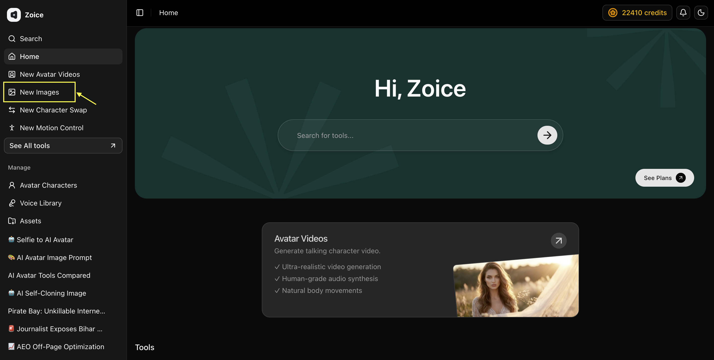
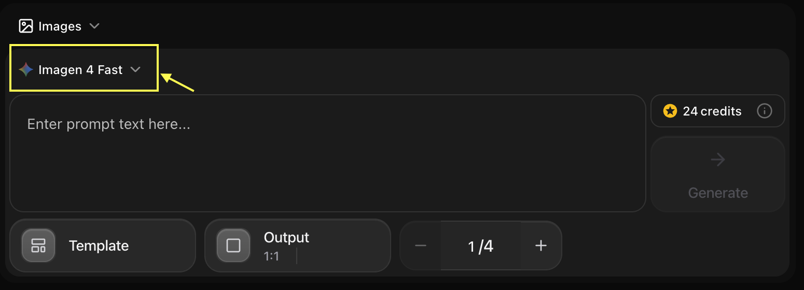
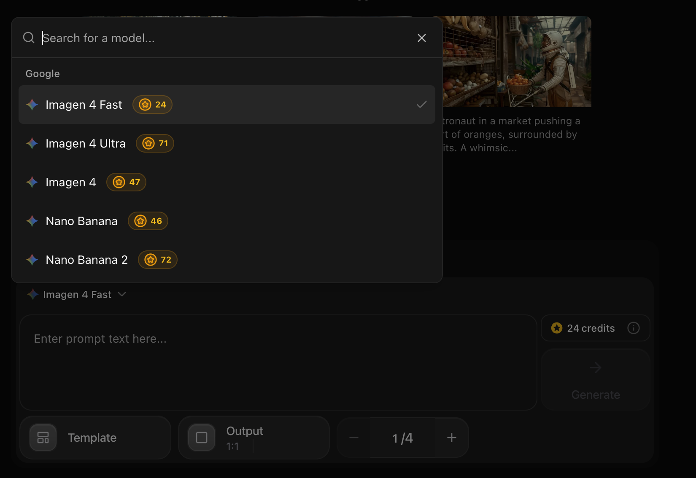
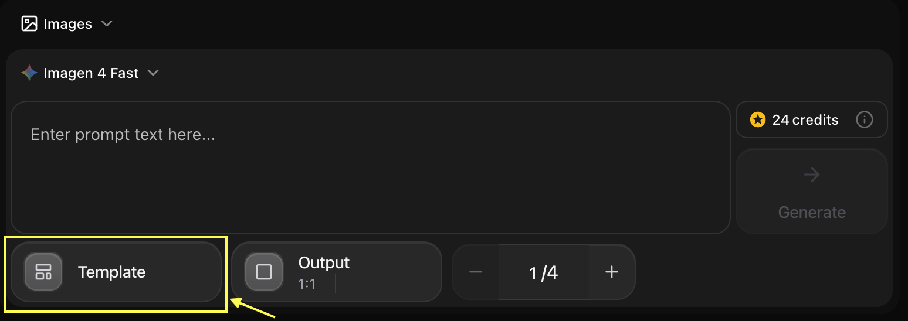
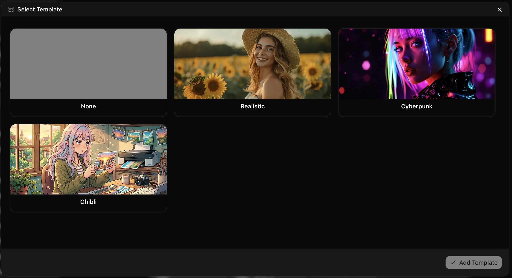
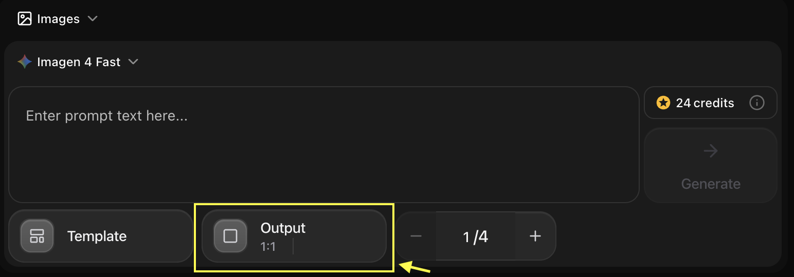
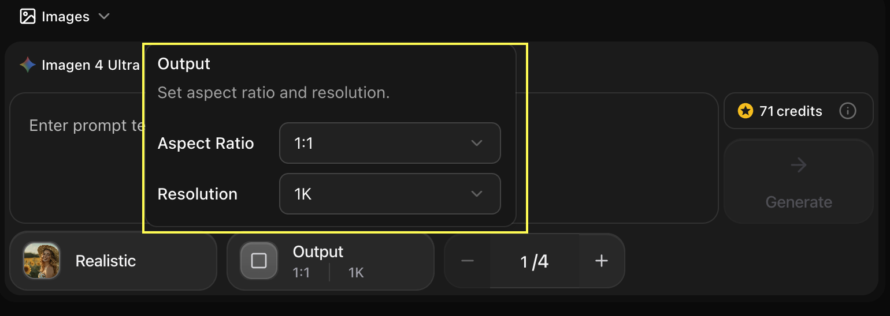
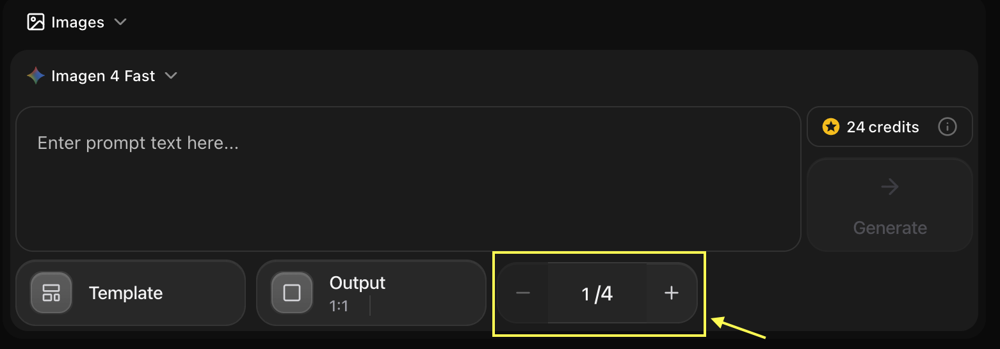
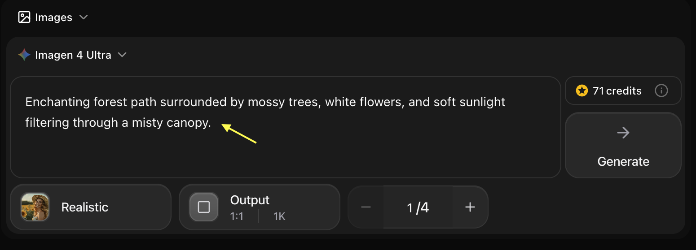
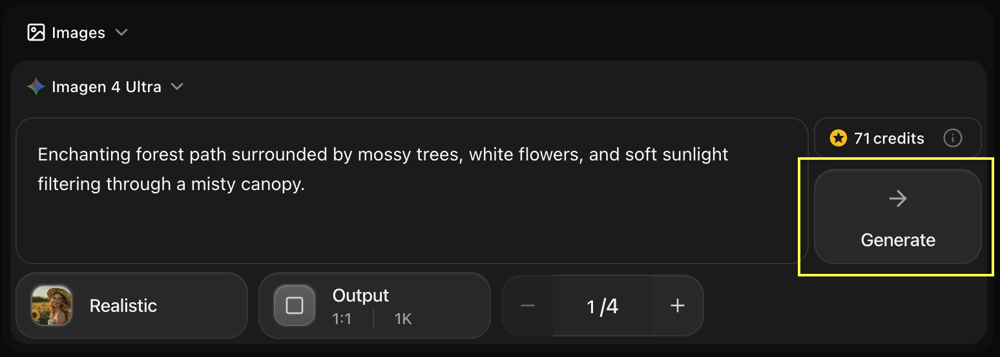

## Key Features

Zoice's Image Generator allows you to create high-quality, unique images from simple text descriptions. Whether you need artwork, graphics, product mockups, or creative visuals, our AI-powered image generation makes it easy to bring your ideas to life.

- **Integrated Model Selector**: Select your preferred AI model (e.g., *Imagen 4 Fast*) directly within the prompt input panel for a cleaner, unified workspace.
- **Prompt Suggestions**: Get inspired with clickable suggestion cards displaying pre-configured sample prompts and sample generated images.
- **Template Styles**: Apply preset templates and visual styles with a single click using the **Template** selector.
- **Aspect Ratio Controls**: Set the precise output size (e.g., `1:1`, `16:9`) using the **Output** settings button.
- **Batch Generation**: Customize the number of images to generate (from 1 to 4) using the batch count counter (`- / +`).
- **Real-Time Credit Costs**: View the required credit cost per generation dynamically on the dashboard before clicking Generate.
- **Text-to-Image & Image-to-Image**: Feed descriptions or upload visual references to guide the AI's generation.

## Use Cases

<CardGroup cols={2}>
  <Card title="Marketing Materials" icon="bullhorn">
    Create eye-catching visuals for social media, ads, and campaigns
  </Card>
  <Card title="Product Design" icon="palette">
    Generate concept art and product mockups
  </Card>
  <Card title="Content Creation" icon="image">
    Produce unique images for blogs, articles, and websites
  </Card>
  <Card title="Creative Projects" icon="wand-magic-sparkles">
    Bring artistic visions to life for personal or professional projects
  </Card>
</CardGroup>

## How It Works
1. **Navigate to Images**: Go to the Image Generator section in your Zoice dashboard.
2. **Select a Model**: Choose your desired AI model (e.g., *Imagen 4 Fast*) from the dropdown menu located at the top-left of the input panel.
3. **Use Suggestions (Optional)**: Click on one of the suggested cards under the header to instantly populate a prompt.
4. **Enter Your Prompt**: Type the details of the image you want to create in the main prompt input textarea.
5. **Configure Parameters**:
   - Choose a **Template** style to apply preconfigured aesthetics.
   - Adjust the **Output** layout to change the aspect ratio.
   - Select the number of images (1 to 4) to generate simultaneously using the batch counter.
6. **Check Credit Cost**: Confirm the credit cost (e.g., 24 credits) indicated next to the Generate button.
7. **Generate**: Click the **Generate** button to create your images.
8. **Download**: Save your generated images in high quality.

## Getting Started

<Steps>
  <Step title="Navigate to Images">
    Go to the Image Generator section in your Zoice dashboard.
    <Frame>
      
    </Frame>
  </Step>

  <Step title="Select Model">
    Select the AI model you want to use from the model dropdown selector nested directly within the generation card, under the tool selector dropdown.
    <Frame>
      
    </Frame>
    Click on sleceted model to change into diffrent model.
    <Frame>
      
    </Frame>
  </Step>

  <Step title="Configure Settings">
    Set your generation styles with **Template**, choose the layout using **Output**, and adjust the batch size (1 to 4 images) using the counter.
    * Click on template to change the style.
    <Frame>
      
    </Frame>
    Select the template according to your needs.
    <Frame>
      
    </Frame>
    * Click on output to change the aspect ratio.
    <Frame>
      
    </Frame>
    Select the output style like image aspect ratio, image qulity.
    <Frame>
      
    </Frame>
    * Click on counter to change the batch size.
    <Frame>
      
    </Frame>
    Select the number of images you want to generate according to your needs.
    <Frame>
      
    </Frame>
  </Step>

  <Step title="Write Prompt or Choose Suggestion">
    Write a detailed prompt in the text area, or click one of the suggested prompt cards above the generator panel to populate the prompt field automatically.
    <Frame>
      
    </Frame>
  </Step>

  <Step title="Generate">
    Check the credit cost on the right side of the input panel and click the **Generate** button.
    <Frame>
      
    </Frame>
  </Step>

  <Step title="Download">
    Save your generated images to your device.
  </Step>
</Steps>

<Tip>
For best results, be specific in your prompts. Include details about style, colors, composition, and mood.
</Tip>

## Next Steps

<CardGroup cols={2}>
  <Card title="Nano Banana (Fast)" icon="bolt" href="/ai-models/image/nano-banana/overview">
    Our fastest model for rapid prototyping and social media.
  </Card>
  <Card title="Imagen 4 (Premium)" icon="gem" href="/ai-models/image/imagen-4/overview">
    Professional photorealistic quality for marketing and print.
  </Card>
  <Card title="Text-to-Image Guide" icon="text" href="/zoice-tools/image-generator/text-to-image">
    Detailed steps for generating images from text.
  </Card>
  <Card title="Prompt Guide" icon="book" href="/prompt-guide/introduction">
    Master the art of writing effective AI prompts.
  </Card>
</CardGroup>
