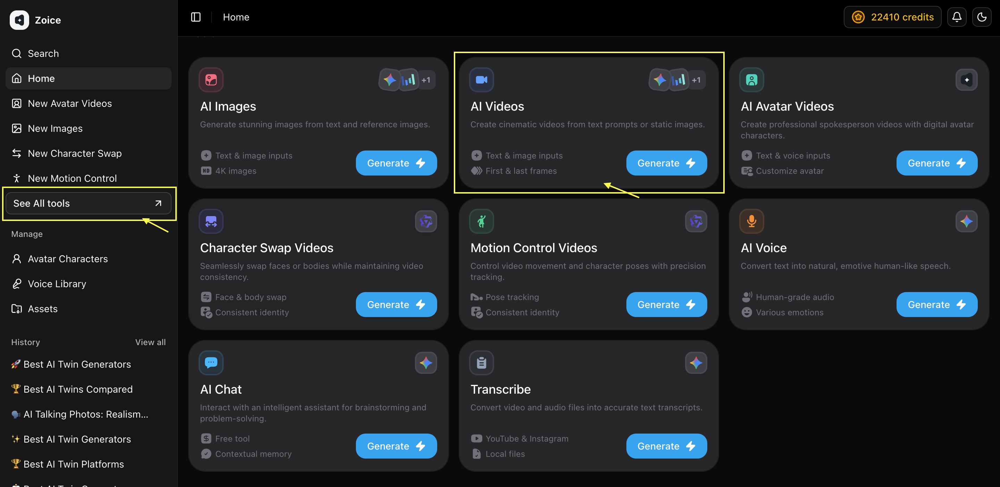
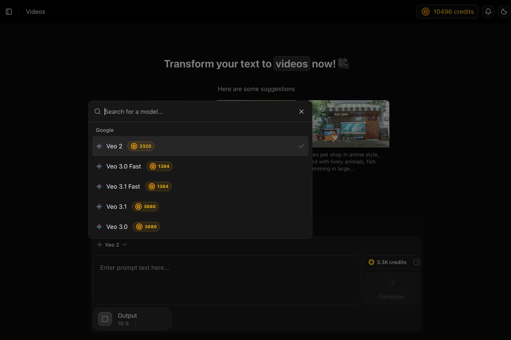
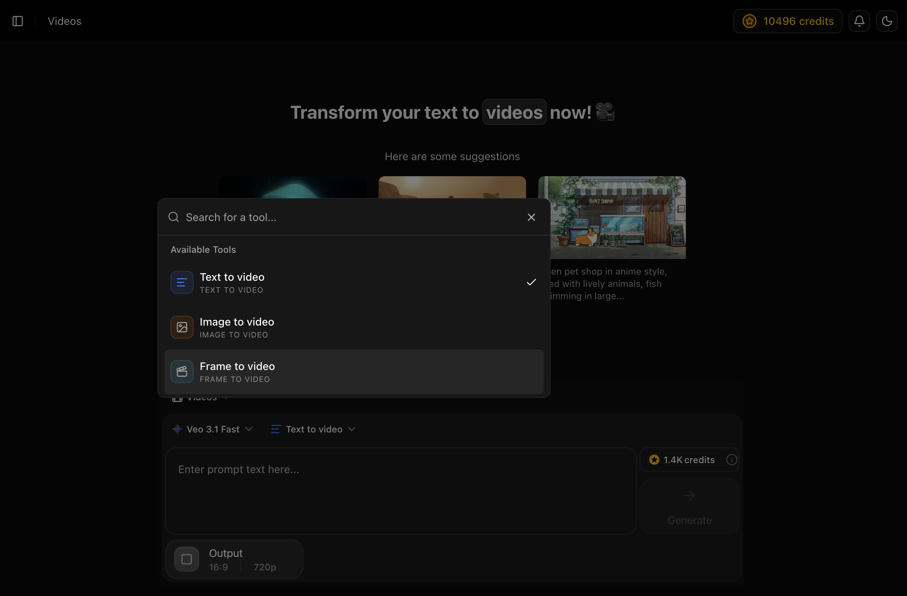
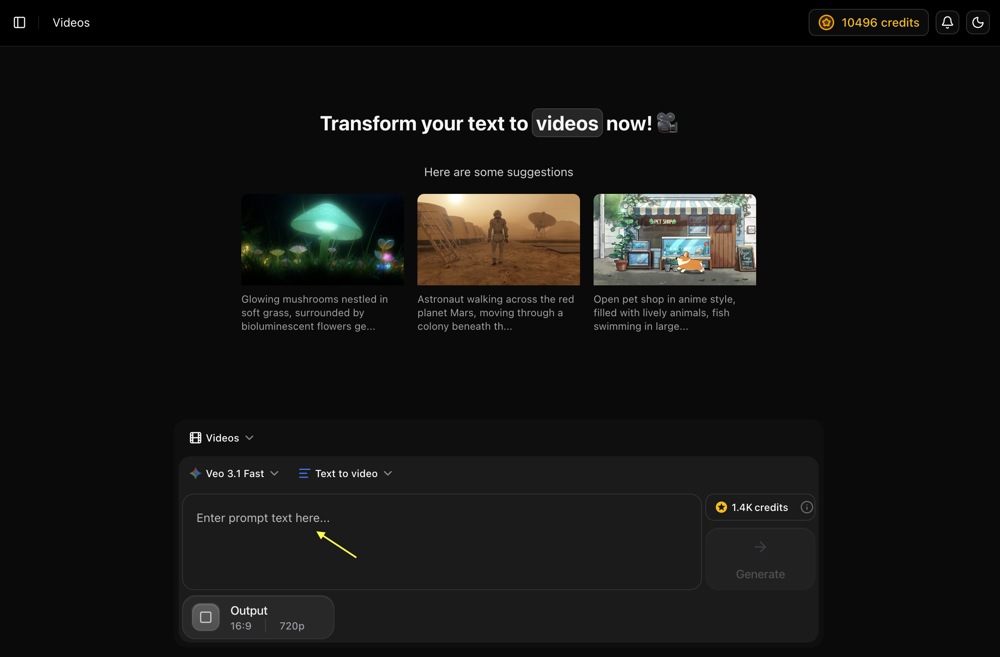
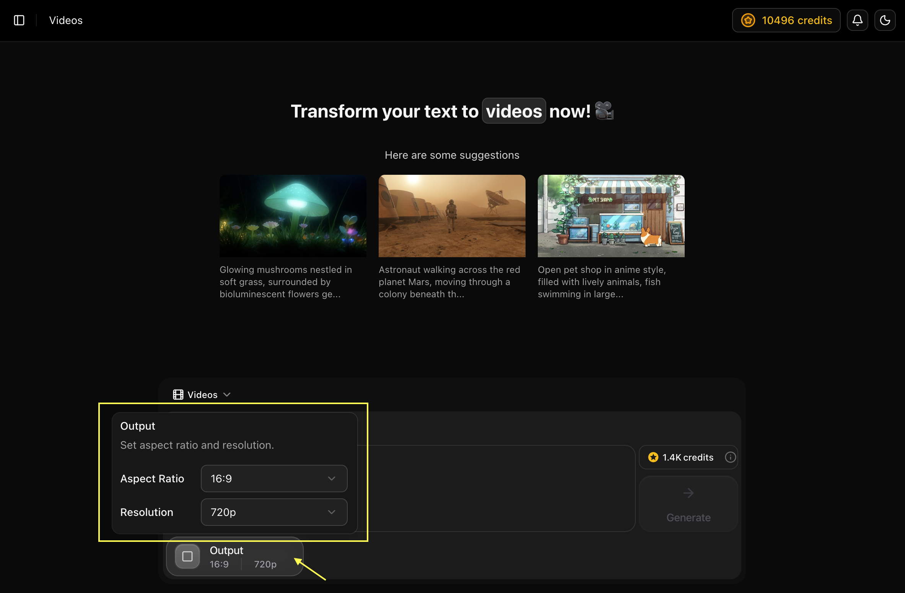

## Key Features

Zoice's Video Generator empowers you to create engaging, high-quality videos using AI. From marketing content to creative projects, transform your ideas into dynamic video content with just a text description.

- **Multiple Video Generation Modes**: Create videos using Text to Video, Image to Video, Image Reference to Video, or Frame to Video.
- **Advanced Video Models**: Choose from Veo 2, Veo 3.0, Veo 3.1, and fast variants based on quality or speed requirements.
- **Aspect Ratio Control**: Generate videos in supported formats such as 16:9.
- **Resolution Selection**: Start video generation at 720p, with higher resolutions available depending on the selected model.
- **Prompt-Based Creation**: Describe scenes using natural language to control visuals, motion, and style.
- **Visual Guidance Support**: Use reference images or frames to guide composition, consistency, and motion.
- **Flexible Workflow**: Switch between video generation modes directly from the interface without restarting.

## Use Cases

<CardGroup cols={2}>
  <Card title="Social Media Content" icon="video">
    Create engaging videos for Instagram, TikTok, and YouTube
  </Card>
  <Card title="Marketing Campaigns" icon="chart-line">
    Generate promotional videos and advertisements
  </Card>
  <Card title="Product Demos" icon="box">
    Showcase products with dynamic video presentations
  </Card>
  <Card title="Creative Storytelling" icon="film">
    Bring stories and concepts to life with AI-generated video
  </Card>
</CardGroup>

## How It Works

1. **Navigate to AI Videos**: From the Zoice dashboard, click **See All Tools** in the left navigation, then click the **AI Videos** card
2. **Select a Model**: Choose your preferred Veo model (e.g., *Veo 3.1 Fast*) from the model selector in the generation panel
3. **Choose Generation Mode**: Select **Text to Video**, Image to Video, or another mode from the mode dropdown
4. **Write Your Prompt**: Type a detailed scene description in the prompt input box
5. **Check Output Settings**: Verify the aspect ratio (e.g., 16:9) and resolution (e.g., 720p) at the bottom of the panel
6. **Generate**: Review the credit cost and click **Generate**
7. **Download**: Save your finished video in high quality

## Getting Started

<Steps>
  <Step title="Navigate to AI Videos">
    Go to the Zoice dashboard and click **See All Tools** in the left sidebar.
    <Frame>
      
    </Frame>
    In the tools grid that appears, click on the **AI Videos** card to open the video generator.
  </Step>

  <Step title="Select AI Model">
    In the generation panel, click the model selector (e.g., **Veo 3.1 Fast**) to choose your preferred AI model.
    <Frame>
      
    </Frame>
    Click on the currently selected model to switch to a different model based on your quality or speed requirements.
  </Step>

  <Step title="Select Generation Mode">
    Click the mode dropdown next to the model selector and choose your generation mode.
    <Frame>
      
    </Frame>
    Select **Text to Video** to generate from a text description, or choose Image to Video / Frame to Video to use visual inputs.
  </Step>

  <Step title="Write Your Prompt">
    Type a detailed description of the video scene you want to create in the prompt input box.
    <Frame>
      
    </Frame>
    Include details like camera movements, lighting, mood, and action for best results.
  </Step>

  <Step title="Generate">
    Check the credit cost displayed next to the **Generate** button and verify the **Output** settings (e.g., 16:9 aspect ratio, 720p resolution) at the bottom of the panel. Then click **Generate**.
    <Frame>
      
    </Frame>
  </Step>

  <Step title="Download">
    Once your video is ready, save it to your device in high quality.
  </Step>
</Steps>

<Tip>
Include camera movements, lighting, and action details in your prompts for more dynamic videos.
</Tip>

## Next Steps

<CardGroup cols={2}>
  <Card title="Veo 3.1 (Latest)" icon="film" href="/ai-models/video/veo-3-1/overview">
    Our most advanced video model with enhanced realism and motion.
  </Card>
  <Card title="Text-to-Video Guide" icon="text" href="/zoice-tools/video-generator/text-to-video">
    Step-by-step instructions for creating video from text.
  </Card>
  <Card title="Image-to-Video Guide" icon="image" href="/zoice-tools/video-generator/image-ref-to-video">
    Learn how to animate your photos using AI.
  </Card>
  <Card title="Prompt Guide" icon="book" href="/prompt-guide/introduction">
    Master technical video prompting
  </Card>
</CardGroup>
