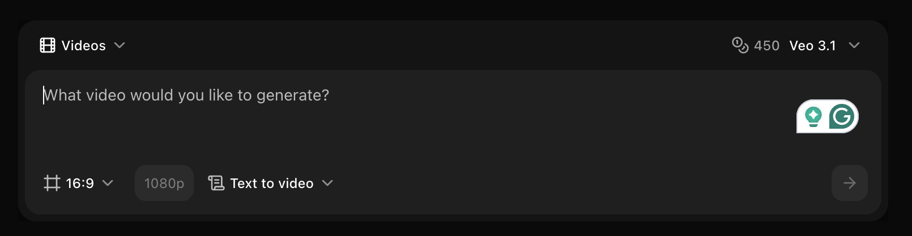
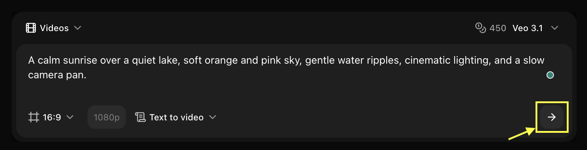

## Key Features

Zoice's Video Generator empowers you to create engaging, high-quality videos using AI. From marketing content to creative projects, transform your ideas into dynamic video content with just a text description.

- **Multiple Video Generation Modes**: Create videos using Text to Video, Image to Video, Image Reference to Video, or Frame to Video.
- **Advanced Video Models**: Choose from Veo 2, Veo 3.0, Veo 3.1, and fast variants based on quality or speed requirements.
- **Aspect Ratio Control**: Generate videos in supported formats such as 16:9.
- **Resolution Selection**: Start video generation at 720p, with higher resolutions available depending on the selected model.
- **Prompt-Based Creation**: Describe scenes using natural language to control visuals, motion, and style.
- **Visual Guidance Support**: Use reference images or frames to guide composition, consistency, and motion.
- **Flexible Workflow**: Switch between video generation modes directly from the interface without restarting.

## Use Cases

<CardGroup cols={2}>
  <Card title="Social Media Content" icon="video">
    Create engaging videos for Instagram, TikTok, and YouTube
  </Card>
  <Card title="Marketing Campaigns" icon="chart-line">
    Generate promotional videos and advertisements
  </Card>
  <Card title="Product Demos" icon="box">
    Showcase products with dynamic video presentations
  </Card>
  <Card title="Creative Storytelling" icon="film">
    Bring stories and concepts to life with AI-generated video
  </Card>
</CardGroup>

## How It Works

1. **Write Your Prompt**: Describe the video scene you want to create
2. **Choose a Model**: Select from various Veo models based on your needs
3. **Set Parameters**: Configure duration, resolution, and motion settings
4. **Generate**: Let AI create your video
5. **Download**: Save your video in high quality

## Getting Started

<Steps>
  <Step title="Navigate to New Video">
    Navigate to the New Video or AI Video in your Zoice dashboard
    <Frame>
      
    </Frame>
  </Step>

  <Step title="Select Model">
    Choose the video model that best fits your needs
    <Frame>
      
    </Frame>
  </Step>

  <Step title="Configure Settings">
    Choose duration, resolution, quality settings, and generation mode
    <Frame>
      
    </Frame>
  </Step>

  <Step title="Describe Your Scene">
    Write a detailed description of the video you want
    <Frame>
      
    </Frame>
  </Step>

  <Step title="Generate Video">
    Click generate and wait for processing
    <Frame>
      
    </Frame>
  </Step>

  <Step title="Download">
    Save your generated video
  </Step>
</Steps>

<Tip>
Include camera movements, lighting, and action details in your prompts for more dynamic videos.
</Tip>

## Next Steps

<CardGroup cols={2}>
  <Card title="Video Prompt Guide" icon="book" href="/prompt-guide/introduction">
    Learn how to write effective video prompts
  </Card>
  <Card title="Explore Video Models" icon="microchip" href="/ai-models">
    Learn about different video generation models
  </Card>
</CardGroup>
