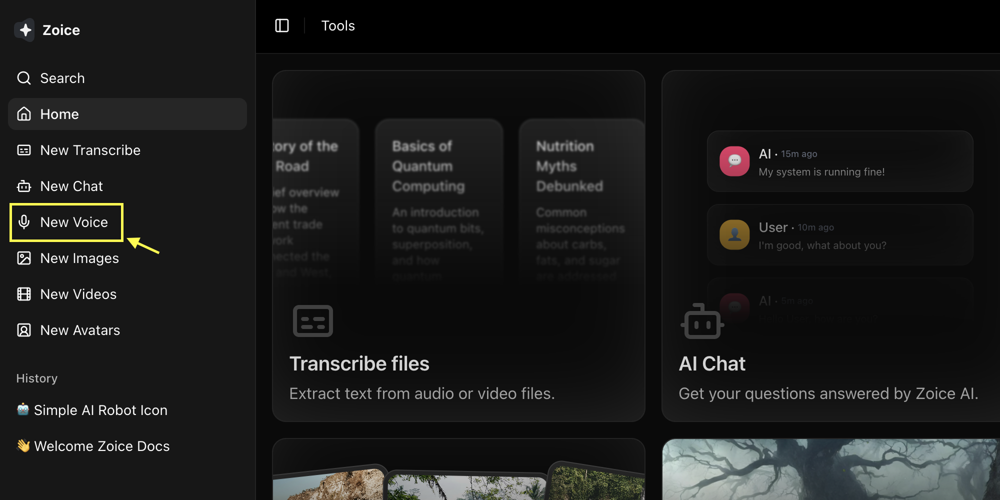
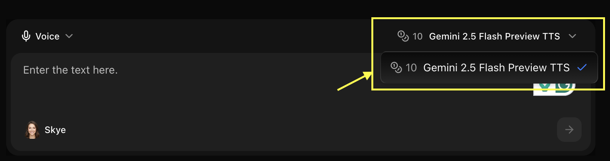
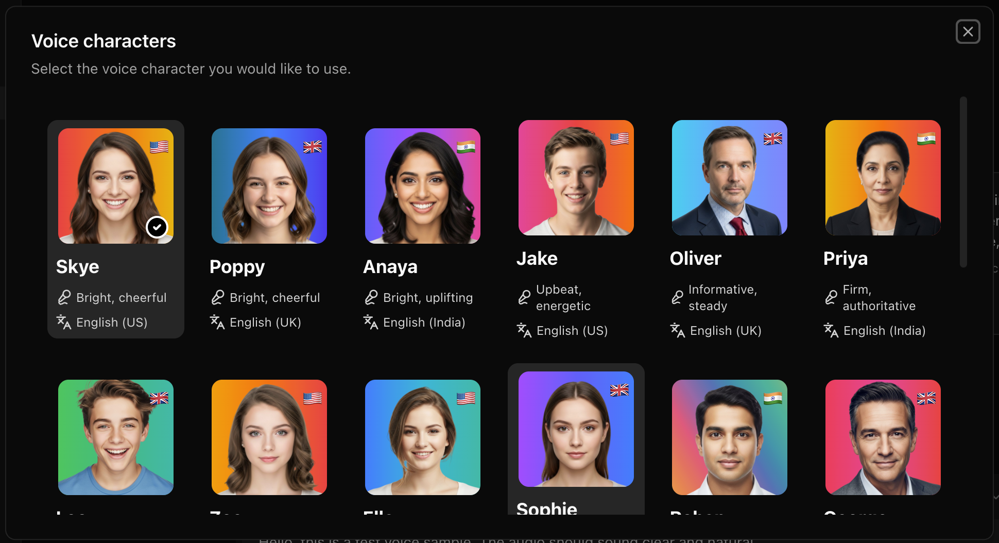
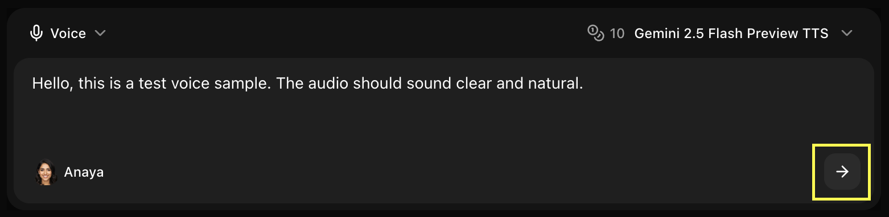

## Overview

Zoice's Voice Generator converts your text into natural, human-like speech. Perfect for voiceovers, audiobooks, podcasts, and more, our AI voice technology delivers high-quality audio by allowing you to choose from a curated selection of professional voice templates.

## Key Features

- **Text-to-Speech**: Transform any text into high-quality, natural-sounding speech instantly.
- **Voice Templates**: Select from a diverse range of pre-defined voices across different genders, ages, and accents.
- **High-Fidelity Audio**: Generate clear, studio-quality audio suitable for professional projects.
- **Fast Generation**: Process and receive your audio files in seconds.
- **Language Support**: Support for a variety of languages and regional dialects.

## Use Cases

<CardGroup cols={2}>
  <Card title="Video Voiceovers" icon="microphone">
    Create professional narration for your YouTube videos, social media, and ads.
  </Card>
  <Card title="E-Learning" icon="graduation-cap">
    Generate engaging narration for educational content and training materials.
  </Card>
  <Card title="Podcasts & Audio" icon="podcast">
    Convert scripts into audio for podcasts or broadcast-style content.
  </Card>
  <Card title="Accessibility" icon="universal-access">
    Make written content more accessible by providing high-quality audio versions.
  </Card>
</CardGroup>

## How It Works

1. **Input Text**: Enter the specific text or script you want to convert to speech.
2. **Choose Template**: Browse and select a voice from our library of sample voice templates.
3. **Generate**: Click the generate button to create your high-quality audio file.
4. **Download**: Save your generated audio file directly to your device.

## Getting Started

<Steps>
  <Step title="Navigate to New Voice">
    Navigate to the new voice generator page.
    <Frame>
      
    </Frame>
  </Step>

  <Step title="Select Model">
    Choose the AI model you want to use for your voice generation
    <Frame>
      
    </Frame>
  </Step>

  <Step title="Write Your Text">
    Enter the text or script you want to hear in the voice-over section.
    <Frame>
      
    </Frame>
  </Step>

  <Step title="Select Voice Over Template">
    Browse the sample templates and choose the voice that best fits your content's tone and style.
    <Frame>
      
    </Frame>
  </Step>

  <Step title="Click Generate">
    Click the **Generate** button to process your text into the selected voice.
    <Frame>
      
    </Frame>
  </Step>

  <Step title="Download Your Audio">
    Once processing is complete, download and save your professional AI voiceover.
  </Step>
</Steps>

<Tip>
Ensure your text includes proper punctuation to help the AI voice maintain the correct rhythm and natural pacing during generation.
</Tip>

## Next Steps

<CardGroup cols={2}>
  <Card title="Explore AI Models" icon="microchip" href="/ai-models">
    Learn about the different AI models powering Zoice.
  </Card>
  <Card title="Prompt Guide" icon="lightbulb" href="/prompt-guide/introduction">
    Master effective prompting for better AI results.
  </Card>
</CardGroup>
