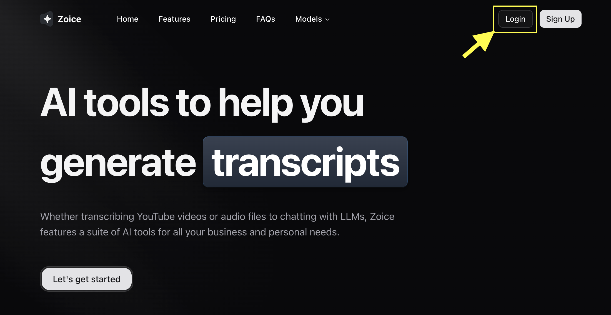

# Image Usage Guide

## Automatic Styling (Recommended)

All images in your MDX files will automatically be styled with consistent framing. Simply use standard markdown image syntax:

```markdown

```

The custom CSS will automatically apply:

- **Max width**: 800px
- **Responsive**: Scales down on smaller screens
- **Rounded corners**: 12px border radius
- **Border**: Light gray border (adapts to dark mode)
- **Shadow**: Subtle drop shadow for depth
- **Centered**: Automatically centered on the page

## Examples

### Single Image

```markdown

```

### Multiple Images

```markdown


```

## Notes

- All images will have the same maximum width (800px) for consistency
- Images smaller than 800px will display at their natural size
- On mobile devices, images will scale to fit the screen width
- Dark mode is automatically supported
