## Benefits of Image to Avatar

Image to Avatar allows you to create AI-generated characters from your uploaded photos. These avatars maintain the likeness of the person in the photo while adding realistic animations, lip-sync, and expressions for video presentations.

- **Personal Branding**: Use your own face or brand representatives
- **Authenticity**: Real people, AI-powered animation
- **Brand Consistency**: Maintain visual brand identity
- **Professional Presence**: Create polished video content
- **Flexibility**: Multiple team members as avatars
- **Reusable**: Create once, use for multiple videos

## Getting Started

<Steps>
  <Step title="Navigate to New Avatar">
    Go to the **New Avatar** section in the left menu of your Zoice dashboard.
    <Frame>
      
    </Frame>
  </Step>

  <Step title="Manage Custom Avatar">
    Select the **Manage Custom Avatar** option to start creating your personalized character.
    <Frame>
      
    </Frame>
  </Step>

  <Step title="Create New">
    Click on the **Create New** button to begin the avatar creation process.
    <Frame>
      
    </Frame>
  </Step>

  <Step title="Select Upload Image">
    Select the **Upload Image** option to upload your own high-quality, front-facing photo to create your avatar's base image.
    <Frame>
      
    </Frame>
  </Step>

  <Step title="Name Your Avatar and Upload your Image">
    Enter a descriptive name for your avatar to easily identify it in your gallery later. and upload your image.
    <Frame>
      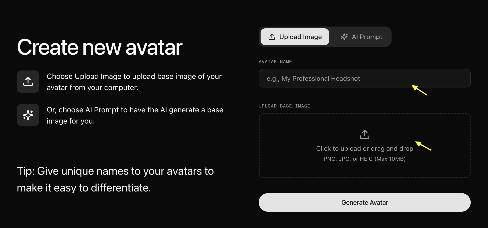
    </Frame>
  </Step>

  <Step title="Click on Generate Avatar">
    Once you've added your image, click on **Generate Avatar**. You will now see your avatar saved in your gallery with that image.
    <Frame>
      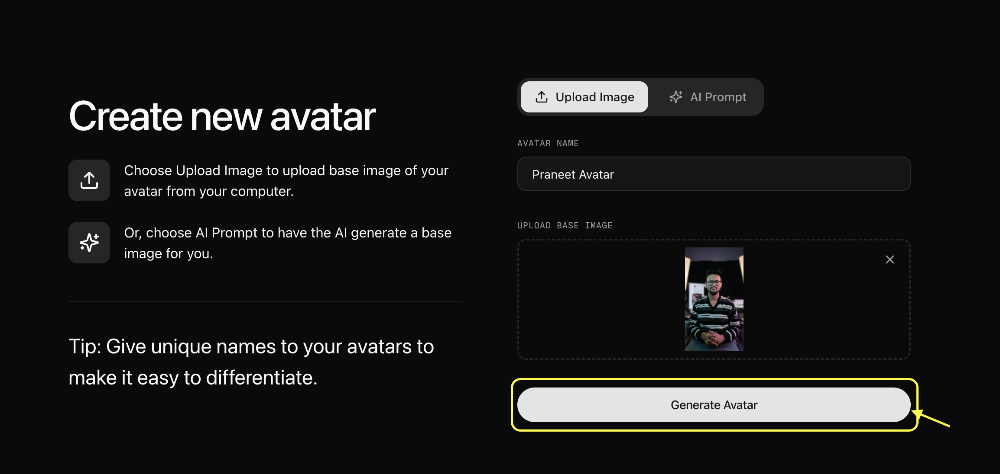
    </Frame>
    We named the `Praneet Avatar` and uploaded the image.
    <Frame>
      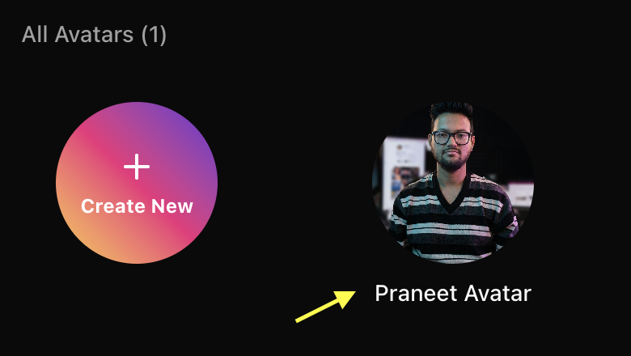
    </Frame>
  </Step>

  <Step title="Select Saved Avatar and Navigate to Settings">
    Click on your saved avatar from the custom avatar gallery to select it and click on settings.
    <Frame>
      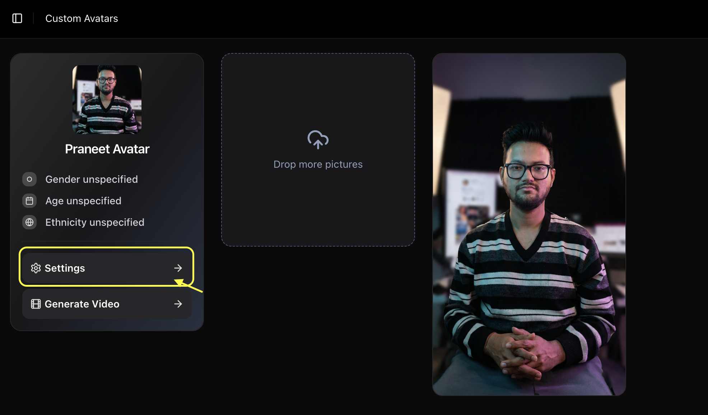
    </Frame>
  </Step>

  <Step title="Fill Profile Details">
    Once selected, click on **Settings** and fine-tune your avatar's profile by adjusting settings like **Age**, **Ethnicity**, and **Gender** to match your vision.
    <Frame>
      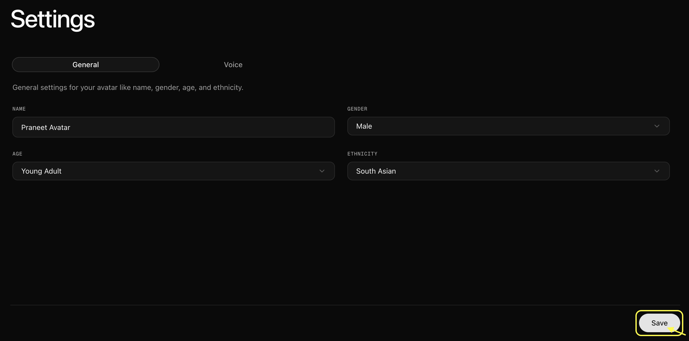
    </Frame>
    Fill the profile details and move to voice options and click on `Create New Voice`.
    <Frame>
      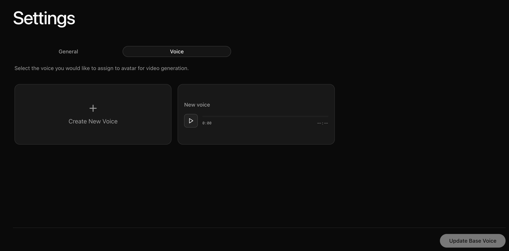
    </Frame>
    Gives name to your voice and upload audio your audio file We have uploaded the voice and named it as `Praneet` voice. Once Uploded Click on `Create Voice`
    <Frame>
      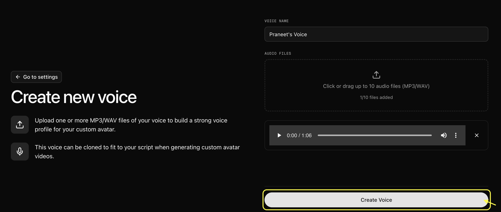
    </Frame>
    Voice is added and marked as base voice. Now Click on `Update Base Voice`.
    <Frame>
      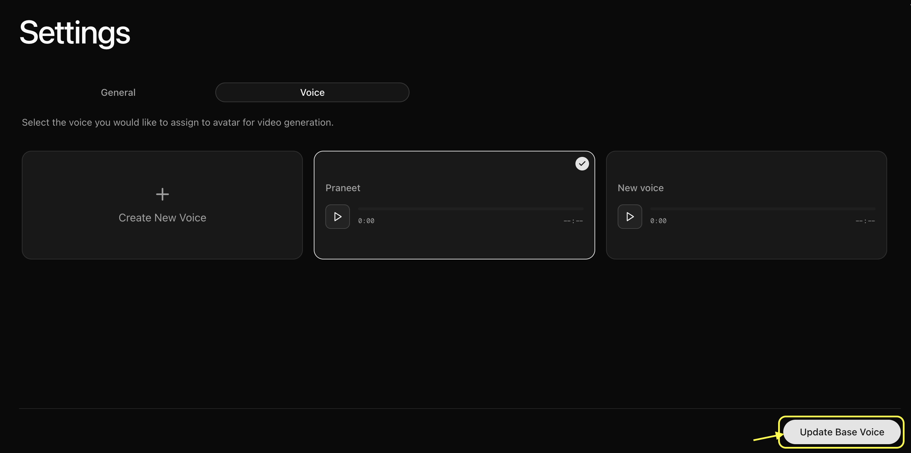
    </Frame>
  </Step>

  <Step title="Go Back to New Avatar Section and Select Custom Avatar">
    Go back to the **New Avatar** section and select **Custom Avatar**. 
    <Frame>
      
    </Frame>
    From here:
    - **Select Avatar**: Select your avatar from the gallery and slect the base image as `Praneet Avatar`.
    <Frame>
      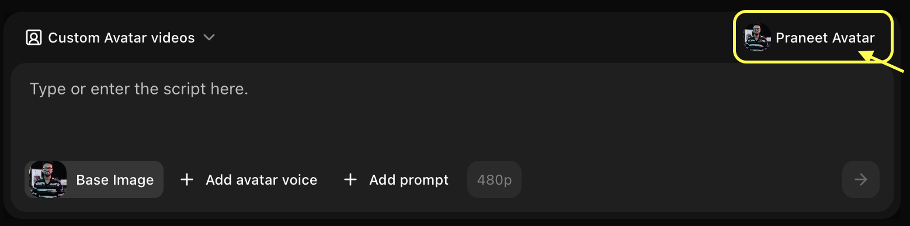
    </Frame>
    - **Click Add Voice**: Select a voice or upload your own voice sample.
    <Frame>
      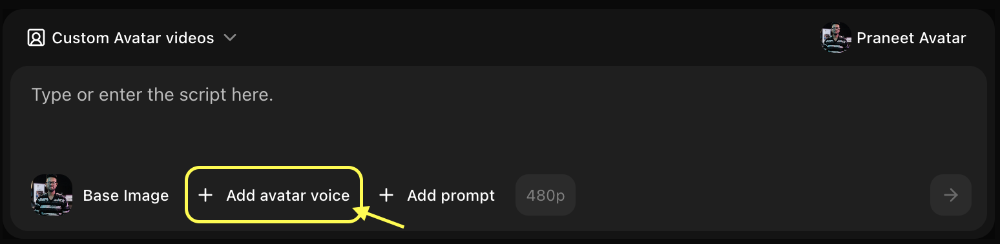
    </Frame>
    - **Upload Voice Sample**: Upload your voice sample want use for avatar.
    <Frame>
      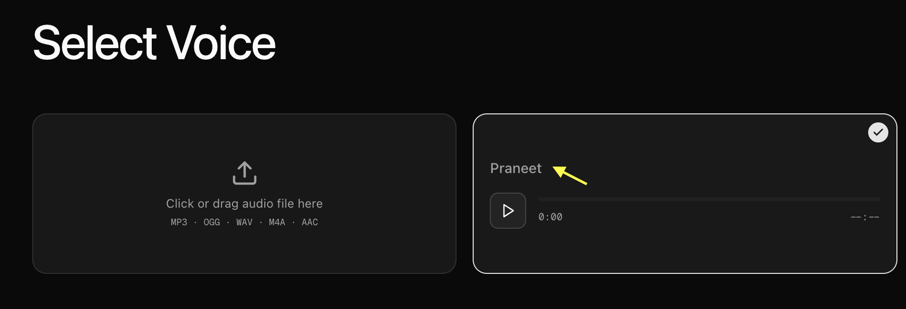
    </Frame>
    - **Add Action**: Define the action you want your avatar to perform like greeting, waving, etc. Click on `Add Prompts`.
    <Frame>
      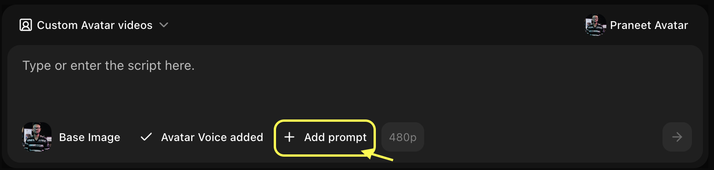
    </Frame>
    - **Write the Action**: Write the action you want your avatar to perform. We given `Talking Head / Presenter Mode (Most Common)`.
    <Frame>
      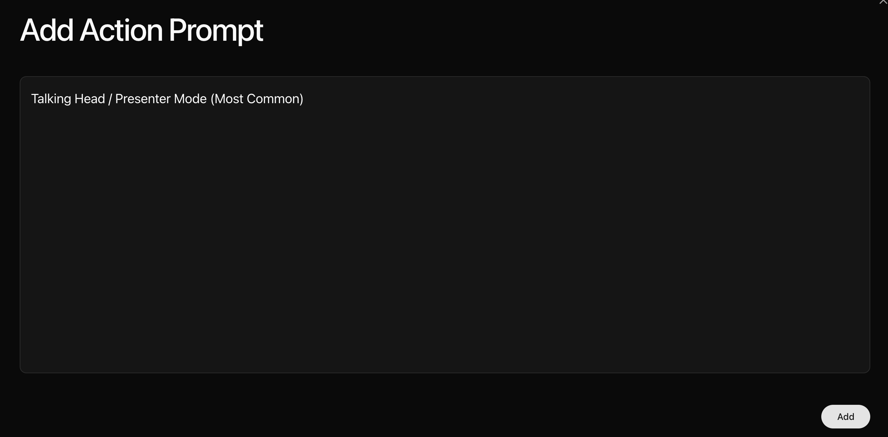
    </Frame>
    - **Resolution**: Choose your preferred video resolution.
    <Frame>
      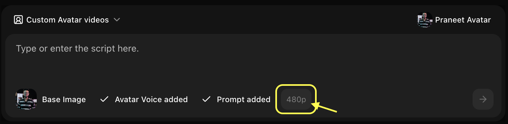
    </Frame>
    - **Write Script**: Enter the text you want your avatar to speak in the script box.
    <Frame>
      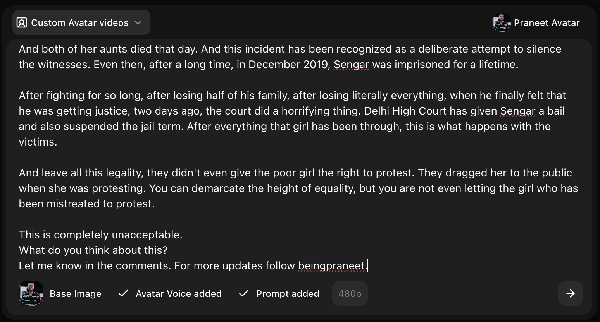
    </Frame>
    - **Generate**: Click on **Generate** to create your final video.
    <Frame>
      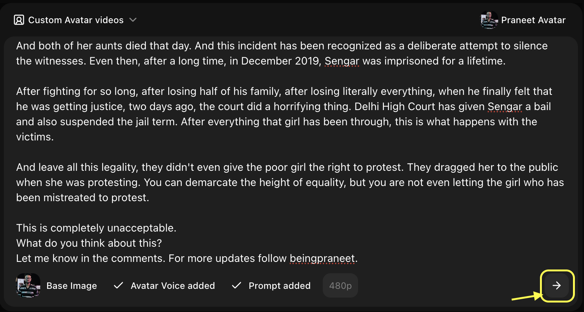
    </Frame>
  </Step>
</Steps>

## Output
- This was the 4K resolution video generated from the image to avatar tool.
<Frame>
  <iframe
    className="w-full aspect-video rounded-xl"
    src="https://www.youtube.com/embed/udwDRYqJ62I"
    title="4K Avatar Video Output"
    frameBorder="0"
    allow="accelerometer; autoplay; clipboard-write; encrypted-media; gyroscope; picture-in-picture"
    allowFullScreen
  ></iframe>
</Frame>
- This was the 1080p resolution video generated from the image to avatar tool.
<Frame>
  <iframe
    className="w-full aspect-video rounded-xl"
    src="https://www.youtube.com/embed/1K0CfNxi-iA"
    title="1080p Avatar Video"
    frameBorder="0"
    allow="accelerometer; autoplay; clipboard-write; encrypted-media; gyroscope; picture-in-picture"
    allowFullScreen
  ></iframe>
</Frame>

## Inputs
- **Image**
<Frame>
  
</Frame>
- **Voice**: `Praneet` voice. ([Listen to voice sample](/images/praneet-voice.mp3))

- **Prompt**: Write the action you want your avatar to perform. We given `Talking Head / Presenter Mode (Most Common)`.
- **Resolution**: Choose your preferred video resolution.
- **Script**: Enter the text you want your avatar to speak in the script box.

<Tip>
For the best results, use a photo with a neutral expression and straightforward gaze.
</Tip>

<Warning>
Generated avatars should not be used to impersonate real individuals without consent.
</Warning>

## Next Steps

<CardGroup cols={2}>
  <Card title="Text to Avatar" icon="text" href="/zoice-tools/ai-avatar-generator/text-to-avatar">
    Create avatars from text descriptions
  </Card>
  <Card title="Voice Generator" icon="microphone" href="/features/voice-generator">
    Add custom voices to your avatars
  </Card>
</CardGroup>
