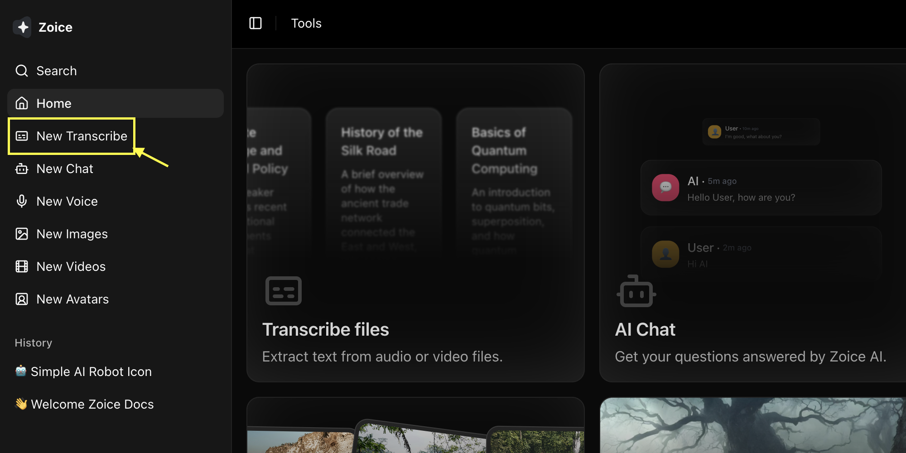
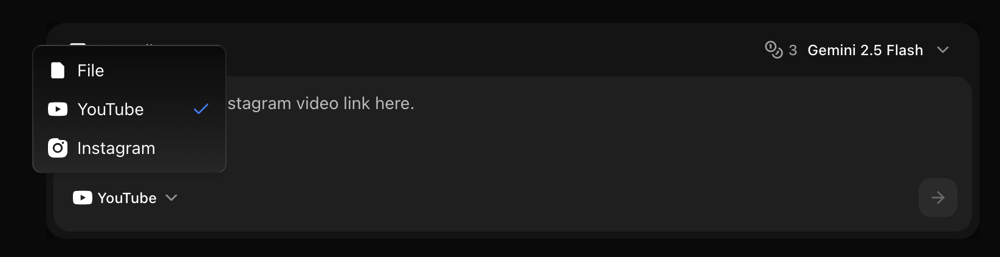
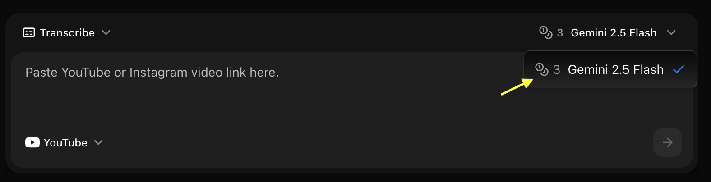
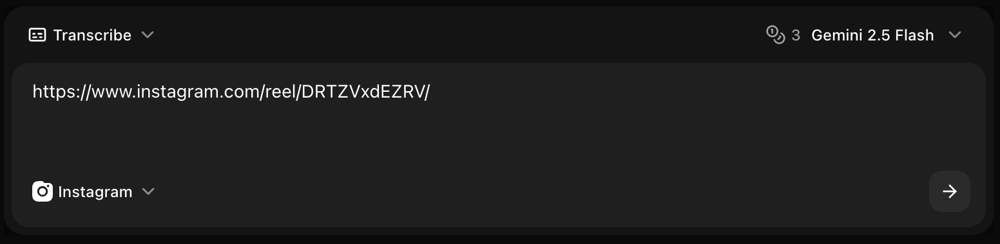
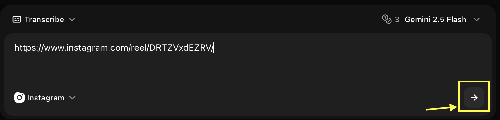

## Quick Start

Convert spoken content in videos into written text with high accuracy.

<Steps>
  <Step title="Navigate to New Transcribe">
    Navigate to the new transcribe section in your dashboard.
    <Frame>
      
    </Frame>
  </Step>
  <Step title="Select Link Type">
    Choose between YouTube, Instagram, or a media file from your device.
    <Frame>
      
    </Frame>
  </Step>
  <Step title="Select Model">
    Choose the AI model you want to use for transcription.
    <Frame>
      
    </Frame>
  </Step>
  <Step title="Paste URL">
    Paste the video URL in the provided box (if applicable).
    <Frame>
      
    </Frame>
  </Step>
  <Step title="Click on Generate">
    Click the **Generate** button to start the process.
    <Frame>
      
    </Frame>
  </Step>
</Steps>

## Supported Video Formats

### File Formats
- **MP4**: Most common, recommended
- **MOV**: Apple QuickTime
- **AVI**: Windows video
- **MKV**: Matroska video
- **WebM**: Web video format
- **FLV**: Flash video

### Specifications
- **Max File Size**: 2GB per file
- **Max Duration**: 3 hours per video
- **Resolution**: Any (audio quality matters most)
- **Audio**: Any codec, stereo or mono

## Language Support

### Supported Languages
Zoice transcription supports 100+ languages including:

- English (US, UK, Australian, Indian)
- Spanish (Spain, Latin America)
- French, German, Italian, Portuguese
- Mandarin, Cantonese, Japanese, Korean
- Hindi, Arabic, Russian, Turkish
- And many more...

### Auto-Detection
Enable automatic language detection for:
- Multilingual videos
- Unknown language content
- Mixed language segments

## Transcription Options

### Timestamp Formats

<Tabs>
  <Tab title="SRT Format">
    ```srt
    1
    00:00:00,000 --> 00:00:03,500
    Welcome to our tutorial on AI transcription.
    
    2
    00:00:03,500 --> 00:00:07,000
    Today we'll learn how to transcribe videos.
    ```
    **Best For:** Subtitles, video players
  </Tab>
  
  <Tab title="VTT Format">
    ```vtt
    WEBVTT
    
    00:00:00.000 --> 00:00:03.500
    Welcome to our tutorial on AI transcription.
    
    00:00:03.500 --> 00:00:07.000
    Today we'll learn how to transcribe videos.
    ```
    **Best For:** Web videos, HTML5 players
  </Tab>
  
  <Tab title="Plain Text with Timestamps">
    ```text
    [00:00:00] Welcome to our tutorial on AI transcription.
    [00:00:03] Today we'll learn how to transcribe videos.
    [00:00:07] Let's get started with the basics.
    ```
    **Best For:** Documentation, notes
  </Tab>
  
  <Tab title="Plain Text Only">
    ```text
    Welcome to our tutorial on AI transcription. Today we'll 
    learn how to transcribe videos. Let's get started with 
    the basics.
    ```
    **Best For:** Articles, blog posts, SEO
  </Tab>
</Tabs>

### Advanced Features

<AccordionGroup>
  <Accordion title="Speaker Identification">
    Automatically detect and label different speakers:
    ```text
    [Speaker 1]: Welcome everyone to today's meeting.
    [Speaker 2]: Thanks for having me.
    [Speaker 1]: Let's begin with the agenda.
    ```
    - Detects up to 10 speakers
    - Labels speakers automatically
    - Option to name speakers manually
  </Accordion>
  
  <Accordion title="Punctuation & Formatting">
    Automatic punctuation and capitalization:
    - Periods, commas, question marks
    - Proper capitalization
    - Paragraph breaks
    - Number formatting
  </Accordion>
  
  <Accordion title="Profanity Filtering">
    Options for handling profanity:
    - **None**: Transcribe as-is
    - **Asterisks**: Replace with f***
    - **Remove**: Omit profane words
    - **Tag**: Mark but don't censor
  </Accordion>
  
  <Accordion title="Custom Vocabulary">
    Add custom words for better accuracy:
    - Company names
    - Product names
    - Technical terms
    - Industry jargon
    - Proper nouns
  </Accordion>
</AccordionGroup>

## Accuracy Optimization

### For Best Results

<CardGroup cols={2}>
  <Card title="Audio Quality" icon="volume-high">
    - Clear audio without background noise
    - Good microphone quality
    - Minimal echo or reverb
    - Consistent volume levels
  </Card>
  
  <Card title="Speech Clarity" icon="microphone">
    - Clear pronunciation
    - Moderate speaking pace
    - Minimal overlapping speech
    - Reduced background conversations
  </Card>
  
  <Card title="Language Settings" icon="language">
    - Select correct primary language
    - Add custom vocabulary
    - Specify dialect if relevant
    - Use auto-detect for mixed languages
  </Card>
  
  <Card title="Content Type" icon="video">
    - Specify content type (interview, lecture, etc.)
    - Enable speaker detection if needed
    - Set appropriate timestamp density
    - Choose relevant formatting
  </Card>
</CardGroup>

## Use Cases

### Subtitle Creation
Generate subtitles for videos:
```
Output: SRT or VTT format
Timestamps: Every 2-5 seconds
Speaker ID: Optional
Use: Upload to YouTube, Vimeo, etc.
```

### Meeting Transcripts
Transcribe business meetings:
```
Output: Plain text with timestamps
Speaker ID: Enabled
Formatting: Paragraphs by speaker
Use: Meeting notes, documentation
```

### Content Repurposing
Convert video to blog posts:
```
Output: Plain text only
Formatting: Paragraphs
Editing: Manual cleanup
Use: Blog articles, social posts
```

### Accessibility
Make content accessible:
```
Output: SRT with descriptions
Timestamps: Detailed
Speaker ID: Enabled
Use: Closed captions, accessibility compliance
```

## Export Formats

### Text Formats
- **TXT**: Plain text
- **DOCX**: Microsoft Word
- **PDF**: Portable document
- **MD**: Markdown format

### Subtitle Formats
- **SRT**: SubRip subtitles
- **VTT**: WebVTT subtitles
- **ASS**: Advanced SubStation Alpha
- **SSA**: SubStation Alpha

### Data Formats
- **JSON**: Structured data with metadata
- **CSV**: Spreadsheet format
- **XML**: Extensible markup

## Post-Processing

### Built-in Editor
Edit transcripts before export:
- Fix errors or typos
- Adjust timestamps
- Merge or split segments
- Add speaker names
- Format text

### Batch Operations
- Find and replace
- Bulk timestamp adjustment
- Speaker renaming
- Format conversion

## Pricing & Credits

### Credit Usage
- **Standard Quality**: 1 credit per minute
- **High Accuracy**: 2 credits per minute
- **Speaker ID**: +0.5 credits per minute
- **Rush Processing**: 2x credits

### Processing Time
- **Standard**: 1x video length
- **Fast**: 0.5x video length
- **Rush**: 0.25x video length

## Common Scenarios

<CardGroup cols={2}>
  <Card title="YouTube Videos" icon="youtube">
    Create captions and transcripts
  </Card>
  <Card title="Podcasts" icon="podcast">
    Generate show notes and transcripts
  </Card>
  <Card title="Interviews" icon="microphone">
    Transcribe interviews with speaker ID
  </Card>
  <Card title="Lectures" icon="chalkboard-user">
    Create study materials from lectures
  </Card>
</CardGroup>

## Troubleshooting

<AccordionGroup>
  <Accordion title="Low accuracy">
    - Check audio quality
    - Add custom vocabulary
    - Verify language selection
    - Use high accuracy mode
    - Reduce background noise
  </Accordion>
  
  <Accordion title="Missing words">
    - Increase audio volume
    - Add words to custom vocabulary
    - Check for audio dropouts
    - Try high accuracy mode
  </Accordion>
  
  <Accordion title="Wrong speaker labels">
    - Manually correct in editor
    - Ensure distinct voices
    - Check microphone setup
    - Reduce voice overlap
  </Accordion>
  
  <Accordion title="Timestamp issues">
    - Adjust timestamp density
    - Check video sync
    - Manually adjust in editor
    - Verify frame rate
  </Accordion>
</AccordionGroup>

<Tip>
For best results, use videos with clear audio and minimal background noise. Consider using a noise reduction tool before transcription if needed.
</Tip>

## Privacy & Security

- **Encrypted Upload**: All videos encrypted in transit
- **Secure Storage**: Temporary storage, auto-deleted after 24 hours
- **No Training**: Your content is never used for model training
- **Confidential**: Transcripts are private to your account

## Next Steps

<CardGroup cols={2}>
  <Card title="Text to Voice" icon="microphone" href="/zoice-tools/voice-generator/text-to-voice">
    Convert text back to professional speech
  </Card>
  <Card title="AI Avatar Generator" icon="user" href="/features/ai-avatar/stock-avatar">
    Create video presentations with AI characters
  </Card>
  <Card title="Voice Generator Guide" icon="volume-high" href="/features/voice-generator">
    Explore the main Voice Generator features
  </Card>
</CardGroup>
