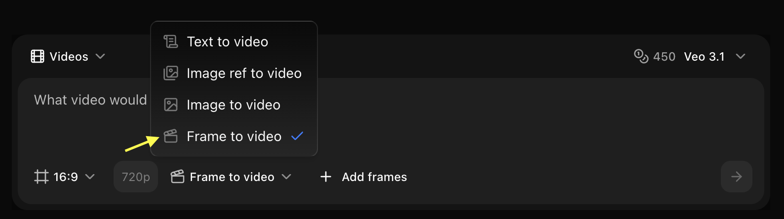

## Quick Start

Upload a series of keyframe images representing different moments in your desired video. Zoice's AI analyzes the differences between frames and generates smooth interpolated frames to create fluid motion.

<Steps>
  <Step title="Navigate to New Video">
    Go to the Video Generator tool in your Zoice dashboard by clicking on **New Video**.
    <Frame>
      
    </Frame>
  </Step>

  <Step title="Select Model">
    Choose a Video model like **Veo 3.0** or **Veo 3.1** based on your project needs.
    <Frame>
      
    </Frame>
  </Step>

  <Step title="Select Size and Resolution">
    Configure the dimensions and quality settings for your video output.
    <Frame>
      
    </Frame>
  </Step>

  <Step title="Select Frame to Video">
    Choose the **Frame to Video** mode to create fluid videos from your keyframe sequences.
    <Frame>
      
    </Frame>
  </Step>

  <Step title="Add Frame">
    Click on the **Add Frame** option to upload your keyframe images in the exact sequence you want them to appear.
    <Frame>
      
    </Frame>
  </Step>

  <Step title="Write Your Text Prompt">
    Enter a detailed description of the motion, interpolation, or style you want the AI to apply between your frames.
    <Frame>
      
    </Frame>
  </Step>

  <Step title="Click on Generate">
    Click on the **Generate** button to begin creating your video.
    <Frame>
      
    </Frame>
  </Step>
</Steps>

## Keyframe Requirements

### Technical Specifications
- **Number of Frames**: 2-20 keyframes
- **Formats**: JPG, PNG, WebP
- **Max Size**: 10MB per frame
- **Resolution**: Consistent across all frames (1920x1080 recommended)
- **Aspect Ratio**: Must be identical for all frames

### Content Guidelines
- Clear progression between frames
- Consistent lighting across frames
- Similar composition and framing
- Logical motion sequence
- High quality, sharp images

## Frame Rate Options

<Tabs>
  <Tab title="24 FPS">
    **Cinematic Standard**
    - Film-like motion blur
    - Cinematic feel
    - Smaller file size
    - Best for: Artistic projects, film-style content
  </Tab>
  
  <Tab title="30 FPS">
    **Standard Video**
    - Smooth motion
    - Balanced quality
    - Standard for web video
    - Best for: General content, social media
  </Tab>
  
  <Tab title="60 FPS">
    **High Frame Rate**
    - Very smooth motion
    - Detailed movement
    - Larger file size
    - Best for: Action sequences, gaming content
  </Tab>
</Tabs>

## Interpolation Settings

### Interpolation Strength

<Tabs>
  <Tab title="Low (2-4 frames)">
    **Minimal Interpolation**
    - 2-4 frames between keyframes
    - More visible steps
    - Faster processing
    - Best for: Stop-motion style, stylized animation
  </Tab>
  
  <Tab title="Medium (5-10 frames)">
    **Balanced Smoothness**
    - 5-10 frames between keyframes
    - Smooth but natural
    - Standard processing
    - Best for: Most use cases, general animation
  </Tab>
  
  <Tab title="High (11-20 frames)">
    **Maximum Smoothness**
    - 11-20 frames between keyframes
    - Ultra-smooth motion
    - Longer processing
    - Best for: Slow-motion effects, fluid animation
  </Tab>
</Tabs>

### Motion Blur
- **None**: Sharp frames, no blur
- **Light**: Subtle motion blur
- **Medium**: Natural motion blur
- **Heavy**: Dramatic motion blur effect

## Use Cases

### Stop-Motion Animation
Create smooth stop-motion videos

<CodeGroup>
```text Setup
Keyframes: 10-15 frames of stop-motion sequence
Frame Rate: 24 fps
Interpolation: Low (2-3 frames)
Motion Blur: None
Result: Stylized stop-motion with slight smoothing
```
</CodeGroup>

### Product Animation
Smooth product rotation or transformation

<CodeGroup>
```text Setup
Keyframes: 8 frames of product at different angles
Frame Rate: 30 fps
Interpolation: High (15 frames)
Motion Blur: Light
Result: Smooth, professional product showcase
```
</CodeGroup>

### Character Animation
Create character movement sequences

<CodeGroup>
```text Setup
Keyframes: 12 frames of character poses
Frame Rate: 24 fps
Interpolation: Medium (8 frames)
Motion Blur: Medium
Result: Fluid character animation
```
</CodeGroup>

### Time-Lapse Smoothing
Smooth out time-lapse sequences

<CodeGroup>
```text Setup
Keyframes: 20 time-lapse photos
Frame Rate: 30 fps
Interpolation: Medium (6 frames)
Motion Blur: None
Result: Smooth time-lapse video
```
</CodeGroup>

## Best Practices

<AccordionGroup>
  <Accordion title="Keyframe Planning">
    - Plan your sequence before shooting
    - Maintain consistent camera position
    - Use tripod for stability
    - Mark positions for repeatability
    - Shoot more keyframes than needed
  </Accordion>
  
  <Accordion title="Lighting Consistency">
    - Use consistent lighting across all frames
    - Avoid auto-exposure changes
    - Manual camera settings recommended
    - Same white balance for all frames
  </Accordion>
  
  <Accordion title="Motion Planning">
    - Keep movements simple between frames
    - Avoid large jumps in position
    - Smooth, gradual changes work best
    - Test with fewer frames first
  </Accordion>
  
  <Accordion title="Quality Control">
    - Use high-resolution images
    - Ensure sharp focus on all frames
    - Check for consistent framing
    - Preview before final generation
  </Accordion>
</AccordionGroup>

## Advanced Techniques

### Easing Control
Control acceleration and deceleration:

- **Linear**: Constant speed throughout
- **Ease In**: Start slow, speed up
- **Ease Out**: Start fast, slow down
- **Ease In-Out**: Slow start and end, fast middle

### Variable Interpolation
Different interpolation between different keyframe pairs:

1. Upload all keyframes
2. Set custom interpolation for each transition
3. More frames for complex movements
4. Fewer frames for simple transitions

### Hybrid Animation
Combine with other techniques:

- Start with keyframes
- Generate interpolated video
- Use as reference for further AI generation
- Add effects or modifications

## Common Scenarios

<CardGroup cols={2}>
  <Card title="Animation" icon="film">
    Create smooth animations from drawings
  </Card>
  <Card title="Product Demos" icon="box">
    Showcase products with controlled motion
  </Card>
  <Card title="Time-Lapse" icon="clock">
    Smooth time-lapse sequences
  </Card>
  <Card title="Tutorials" icon="chalkboard-user">
    Step-by-step visual guides
  </Card>
</CardGroup>

## Workflow Examples

### Stop-Motion Workflow
1. Set up scene and camera
2. Take photo of starting position
3. Move subject slightly
4. Take next photo
5. Repeat 10-15 times
6. Upload frames to Zoice
7. Set low interpolation
8. Generate smooth video

### Product Rotation Workflow
1. Place product on turntable
2. Take photo every 45 degrees (8 total)
3. Ensure consistent lighting
4. Upload frames in order
5. Set high interpolation
6. Add light motion blur
7. Generate smooth rotation

### Character Animation Workflow
1. Draw or pose character in key positions
2. Capture 8-12 keyframes
3. Ensure consistent scale and position
4. Upload sequence
5. Set medium interpolation
6. Add natural motion blur
7. Generate fluid animation

## Troubleshooting

<AccordionGroup>
  <Accordion title="Choppy motion">
    - Increase interpolation frames
    - Check keyframe consistency
    - Ensure smooth progression
    - Add motion blur
  </Accordion>
  
  <Accordion title="Ghosting or artifacts">
    - Reduce interpolation strength
    - Ensure consistent lighting
    - Check for camera movement
    - Use higher quality keyframes
  </Accordion>
  
  <Accordion title="Unnatural movement">
    - Adjust easing settings
    - Reduce large jumps between frames
    - Add more keyframes
    - Lower interpolation count
  </Accordion>
  
  <Accordion title="Inconsistent quality">
    - Use same camera settings for all frames
    - Maintain consistent resolution
    - Check focus on all frames
    - Ensure proper exposure
  </Accordion>
</AccordionGroup>

<Warning>
Large changes between keyframes may result in unpredictable interpolation. Keep movements gradual for best results.
</Warning>

<Tip>
Start with a simple 2-3 frame test to verify your setup before shooting all keyframes.
</Tip>

## Technical Specifications

### Supported Workflows
- **Stop-Motion**: 2-20 keyframes, low interpolation
- **Animation**: 5-15 keyframes, medium interpolation
- **Product**: 4-12 keyframes, high interpolation
- **Time-Lapse**: 10-20 keyframes, medium interpolation

### Output Options
- **Resolution**: Match input or upscale to 4K
- **Format**: MP4 (H.264 or H.265)
- **Frame Rate**: 24, 30, or 60 fps
- **Quality**: Lossless or high-quality compressed

## Next Steps

<CardGroup cols={2}>
  <Card title="Images to Video" icon="images" href="/zoice-tools/video-generator/images-to-video">
    Create videos with transitions
  </Card>
  <Card title="Text to Video" icon="text" href="/zoice-tools/video-generator/text-to-video">
    Generate videos from prompts
  </Card>
  <Card title="Video Models" icon="microchip" href="/ai-models/video/veo-3-1/overview">
    Explore AI video models
  </Card>
</CardGroup>
